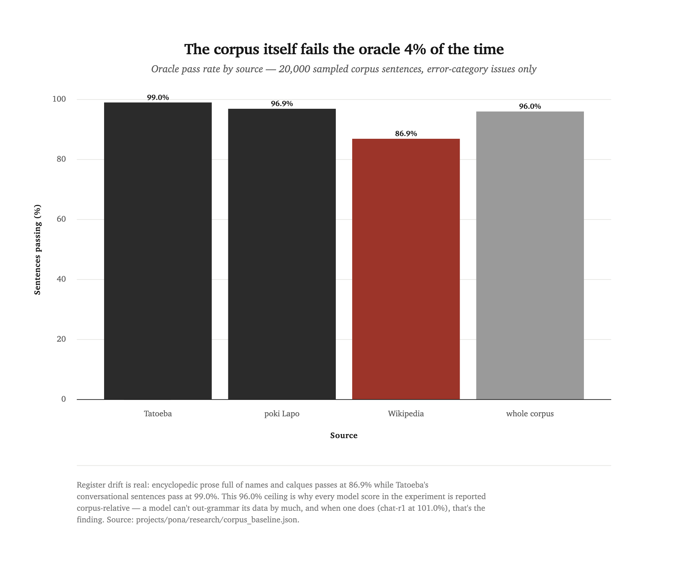
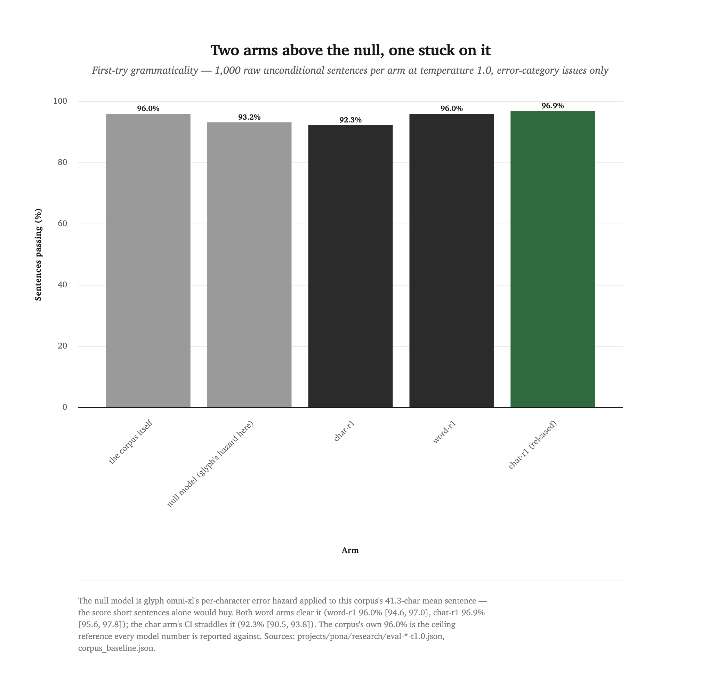
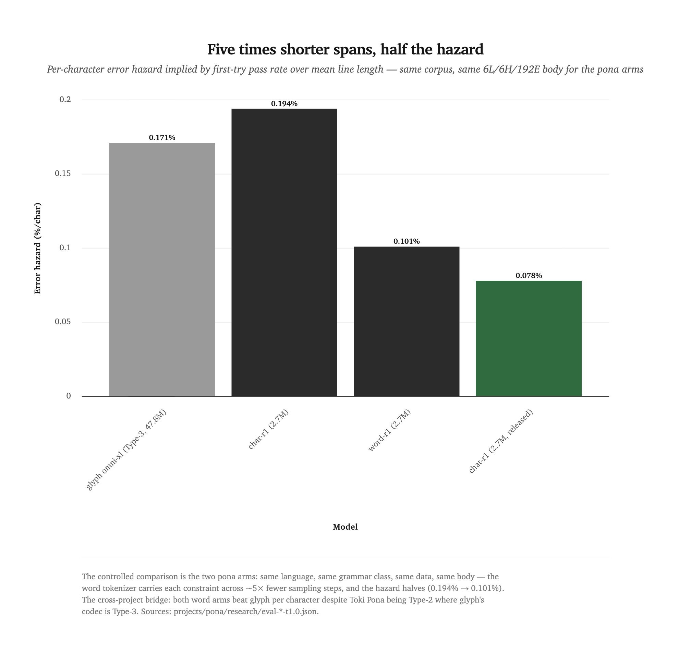

# A language small enough to get right

Toki Pona has ~130 words, 14 letters, no inflection — and a real grammar
checker the community actually uses. That makes it plausibly the first
natural-ish language a studio-scale model can get *right*, where "right" is
machine-checkable instead of vibes. Three 2.7M-parameter GPTs later, the
verdict: the released one writes Toki Pona more grammatically than the
corpus it learned from — 96.9% of raw first-try sentences pass the checker
against the corpus's own 96.0% — and you can talk to it.

The experiment underneath the model is a falsification test. Glyph's report
(experiment 09) left a thesis hanging: **span, not Chomsky-hierarchy
position, predicts what a small model finds hard**. This round put that
thesis in the one configuration that could kill it.

## The bet: span against hierarchy

Glyph's outline codec is a *regular* grammar — Type 3, the formally easiest
class — and a 47.8M model still fails 29% of its 200+ character lines,
losing constraints across long spans. Toki Pona is the inverse
configuration: a *context-free* grammar (Type 2, formally harder) whose
sentences average 41.3 characters. If hierarchy governs difficulty, the
harder grammar should fail more. If span governs, the short sentences
should fail less — per character, not just per line.

The original brief scored this naively ("beat glyph's 71.0% per-line
validity"), comparing across a 4× line-length gap. That target was
re-registered before any model was scored: a null model with exactly glyph
omni-xl's per-character hazard, applied to this corpus's 41.3-char mean
sentence, already scores 0.71^(41.3/200) ≈ 93.2% per line — purely because
the lines are short. So the honest bar is three zones anchored to that
null: above it, span wins; between 71.0% and the null, mixed; below 71.0%,
hierarchy wins. Per-character hazard is the cross-project bridge.

The tokenizer became the second, controlled experiment. Two arms, same
corpus, same 6L/6H/192E 2.7M body, epoch parity — one reads characters, one
reads whole words through a 370-token vocabulary. A Toki Pona sentence that
is ~41 characters is only ~8 word tokens: a within-language span
manipulation with everything else held fixed. The word arm's vocabulary
doubles as the chat interface's keyboard, but that comes later.

## A corpus that gets graded too

6.93M characters survived the filter: Toki Pona Wikipedia (1.83M, CC
BY-SA), the permissively-licensed subset of poki Lapo (1.95M — 822 works
kept, 848 dropped by licence, audit committed), and Tatoeba's `tok` corpus
(3.16M, 78k sentences). Every line passed sonatoki's is-this-Toki-Pona
filter at sentence granularity; digits are excluded by policy (Toki Pona
numbers are words); near-dedup is name-blind, which collapsed 2,270
templated Wikipedia stubs. The 6.39M-token Discord scrape stayed out on
consent grounds — the community never published its chat as a corpus — and
on register-drift grounds besides.

The pre-registered twist: the corpus itself got scored by the same oracle
the models would face. It fails 4% of the time.

<picture>
  <source media="(prefers-color-scheme: dark)" srcset="assets/exp13-corpus-baseline-by-source.dark.png">
  
</picture>

Register drift is concentrated exactly where you'd guess: look at the
Wikipedia bar. Encyclopedic prose full of proper names and calques passes
at 86.9% while Tatoeba's conversational sentences pass at 99.0%. This is
why every model number in this report is also stated corpus-relative — the
corpus's 96.0% is the honest ceiling, and "beats 100%" was never the game.

The oracle is [telo misikeke](https://telo-misikeke.gitlab.io/) (MIT),
vendored at a pinned commit and driven via node with the Linku word list.
Before it was trusted with a single reported number it passed a gate: 16
known-good pu sentences accepted, 7 known-bad sentences flagged. The
headline metric fails a sentence on `error`-category issues only; a strict
rate (all issue classes) rides alongside. Scoring protocol, pinned before
sampling: 1,000 raw unconditional sentences per arm at temperature 1.0, no
top-k, no resampling, the model's own punctuation as segment boundaries.

## The word arms clear the null; the char arm can't

The zones sort cleanly. In the chart, the two gray bars are the references
— the corpus ceiling and the null — and the question is which model bars
sit above the second one.

<picture>
  <source media="(prefers-color-scheme: dark)" srcset="assets/exp13-grammaticality-vs-null.dark.png">
  
</picture>

word-r1 lands at 96.0% [94.6, 97.0] — the corpus's own score, 100.0%
corpus-relative — and chat-r1 at 96.9% [95.6, 97.8], *above* the corpus.
char-r1 lands at 92.3% [90.5, 93.8], a confidence interval that straddles
the 93.2% null: honestly inconclusive against short-sentences-alone. Per
character, the picture is sharper.

<picture>
  <source media="(prefers-color-scheme: dark)" srcset="assets/exp13-hazard-per-char.dark.png">
  
</picture>

The controlled comparison is the pair on the right: same everything except
the tokenizer, and the hazard halves (0.194% → 0.101%). The cross-project
comparison is the outer pair: a 2.7M word model on a Type-2 grammar makes
fewer errors per character than a 47.8M model on a Type-3 codec. Hierarchy
predicted the opposite. One reading: span is doing the work — fewer
autoregressive steps per constraint means fewer chances to drop it. Another
reading: word tokens are also *semantically* cleaner units, and the gain
mixes both effects. The char arm's error taxonomy supports the first: its
failures skew to misspelled words (41 vocabulary-class errors vs the word
arm's 10, plus a 0.334% non-word rate the word arm cannot have by
construction), while the word arm's remaining errors are particle machinery
(23 of 41 hard errors) — it can't misspell, so what's left is grammar
proper. Memorization doesn't explain any of it: 8-gram overlap with the
corpus is 1.2–1.5% across arms, and exact-sentence matches (5–6%)
concentrate in stock lines of the "mi pona." class.

## The dialogue round — 4.6% of the data, all of the behavior

chat-r1 is word-r1's recipe with one change: 122 synthetic dialogues
interleaved into the corpus at ×12 repetition, 4.6% of characters. The
synthetic unlock came with a hard gate — this is the method worth stealing
— **a generated dialogue enters the corpus only if every sentence passes
the same oracle the model is scored by**. The pilot justified the paranoia
immediately: olmo-3-7b answered the Toki Pona prompt in English, the exact
confident-fake-corpus failure the project brief banned synthetic data over,
and the filter caught it by design rather than by luck. The production
sweep (few-shot prompt, hardened parser) kept 43/72 dialogues from
gemma-4-26b, 43/72 from its QAT variant, and 36/72 from qwen3.6-27b — 122
dialogues, 936 turns, every sentence oracle-clean, per-dialogue provenance
committed.

The reply eval puts 20 oracle-verified user turns to each model, 8 replies
apiece:

| metric, t = 0.8 | chat-r1 | word-r1 (no dialogue data) |
|---|---|---|
| grammatical replies | **160/160 (100.0%)** | 96.2% |
| empty replies | 0.0% | 1.2% |
| echoes of the prompt | 0.0% | 0.0% |
| unique replies | 91.9% | 100.0% |
| mean reply length | 6.35 words | 11.6 words |

The ablation column is the story. word-r1 has never seen a dialogue, so it
answers a greeting the only way it can — by continuing prose: grammatical,
fluent, and beside the point, at nearly twice the length. chat-r1 answers
like the dialogues taught it: short, on-topic, terminated. At temperature
1.0 its reply grammaticality is 98.8%; at the shipped 0.8 it is perfect
across the eval. In the multi-turn REPL the context carries — "ken ala
ken" questions get "lon." affirmatives, and after a farewell the
next-word distribution shifts toward tawa and pona. Val loss agrees the mix
cost nothing: 2.457 against word-r1's 2.512 on the same split.

## Be honest: what still doesn't work

- **Pronoun deixis slips.** The model swaps `mi`/`sina` mid-conversation —
  grammatical, wrong person. The oracle is blind to person, so the 100%
  reply number does not certify deixis. Mechanism: 936 turns of two-speaker
  data is enough to teach the turn structure, not the pronoun flip that
  comes with speaker change. Deixis-targeted dialogue data is the obvious
  round 3.
- **Question machinery is the weakest grammar.** `illFormedQuestion` is the
  top nitpick in replies (11 of 160 at t = 0.8) and rides outside the
  error-only headline.
- **The char arm proves nothing by itself.** Its CI straddles the null;
  without the word arms this round would have been a shrug. Single seed per
  arm, too — the hazard halving is one run against one run.
- **Grammatical ≠ true, kind, or coherent.** Every number here is a grammar
  checker's verdict. No eval in this round measures meaning.
- **The ambiguity dial never ran.** P4 (jan Lope's ambiguity parser vs
  temperature) needs SWI-Prolog, which isn't installed — skipped outright
  rather than half-measured.
- **The corpus rebuild drifts.** The three sources are living datasets; the
  frozen folder pins the recipe, dialogue set, tokenizer, and oracle, but a
  re-fetched natural corpus is near-identical, not byte-identical.

## Released: pona-nanogpt-1

chat-r1 froze as `pona-nanogpt-1` — the studio's first word-level release,
first conversational release, and first to ship a quantized `onnx_int8`
artifact (3.1MB, 100% argmax agreement with fp32 on the parity check). Its
370-token vocabulary is literally the interface: the website's
[`/pona`](https://www.supcpu.com/pona/) page renders every token as a key,
with a live top-5 suggestion strip driven by the model's own next-token
distribution. The [model card](../model-cards/pona-nanogpt-1.md) carries
the numbers above with their denominators.

## Reproduce it

Everything regenerates from the frozen folder
(`projects/pona/models/pona-nanogpt-1/`), in place:

```bash
python fetch_wikipedia.py && python fetch_tatoeba.py && python fetch_poki.py
python build_corpus.py                                # sonatoki + dedup + gate
python build_chat_corpus.py --reps 12                 # + the pinned dialogue.txt
python prepare.py --arm word --corpus corpus/chat.txt --out-suffix chat
python train.py config.py                             # ~3 min on an M4
python oracle/fetch_oracle.py && python oracle/verify_oracle.py
python harness.py --out_dir .                         # the oracle eval
python chat_eval.py --out_dir .                       # the reply eval
```

The span thesis now has two data points from opposite ends of the
hierarchy, and they agree: what a small model finds hard is not how formal
the grammar is but how far it has to carry each rule. The next dial to turn
is scale — whether a 10M word arm closes the remaining 3% — and whether
deixis-targeted dialogue can teach the pronoun flip that 936 turns didn't.

## Credits

Corpus policy, oracle vendoring, both tokenizers, training, evals, the
dialogue round, and this write-up: Claude Fable 5 (Claude Code). Direction,
the synthetic-data authorization and its oracle-gate condition, and the
release verdict: Romello Goodman. The oracle is telo misikeke by jan Lepeka
(MIT), with the Linku word list; corpus sources: Toki Pona Wikipedia (CC
BY-SA), poki Lapo (permissive subset, per-work audit committed), Tatoeba
(CC BY 2.0 FR). Dialogue generators: gemma-4-26b, gemma-4-26b-qat,
qwen3.6-27b via LM Studio, filtered as described.
