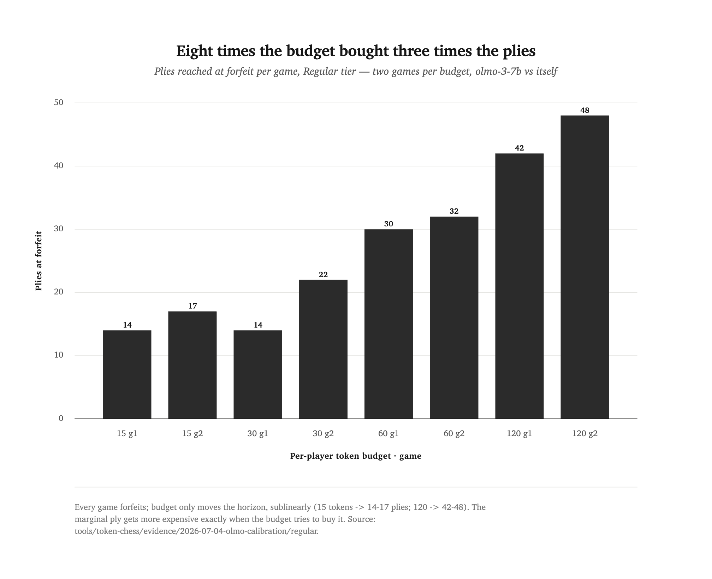
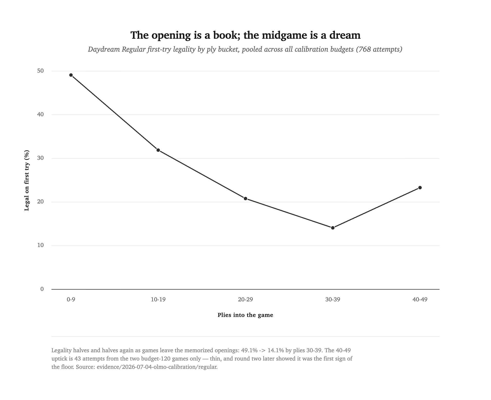
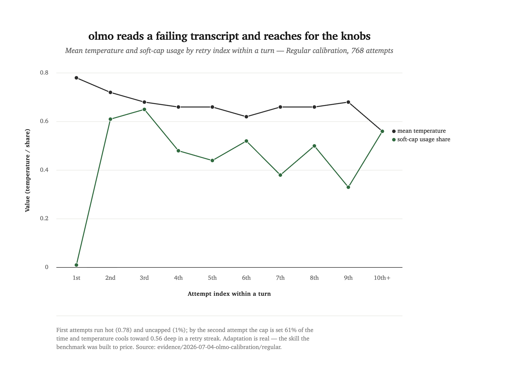
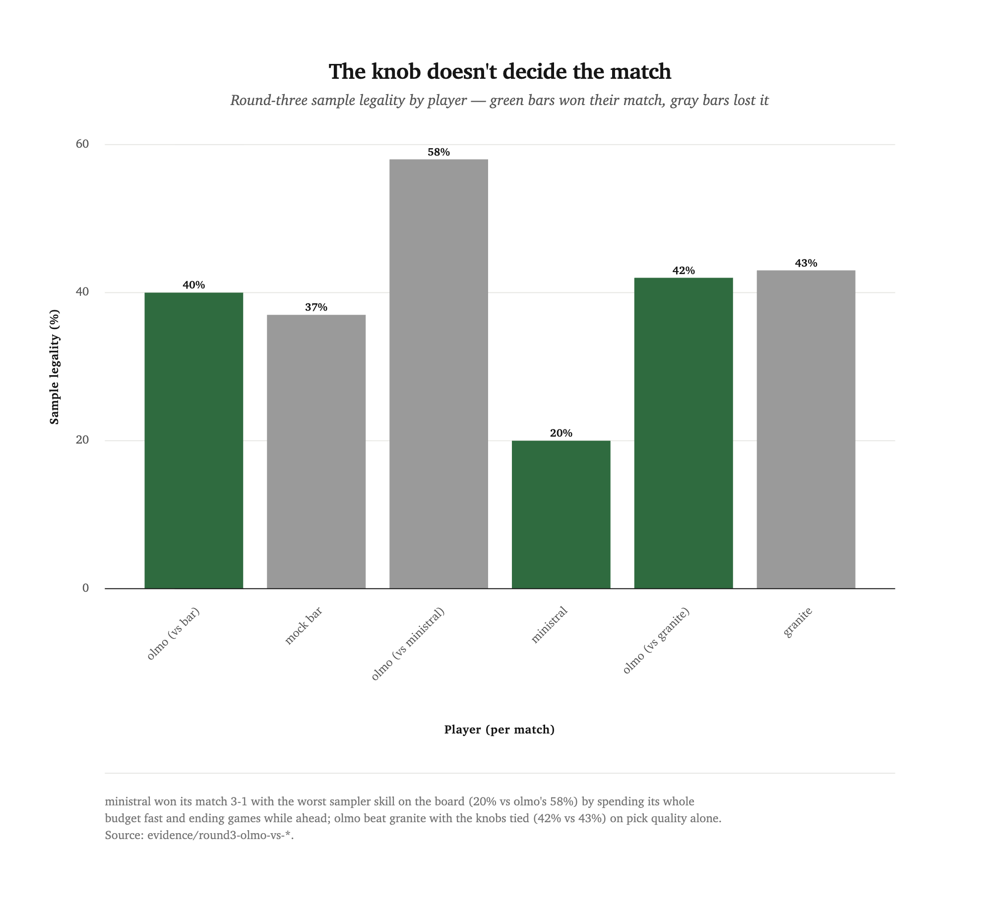
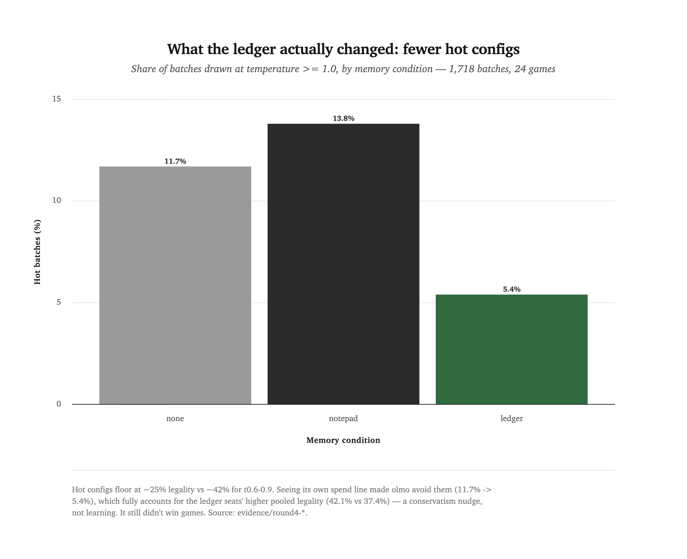

[← all reports](README.md) · series: token-chess · evidence `tools/token-chess/evidence/` · July 2026

# Can a token budget buy a finished chess game?

No — and each round of asking taught the benchmark something it kept.
[Token Chess](../../tools/token-chess/README.md) is a benchmark, not a
model: two LLM players share a board, but neither may author a move
from its own chess knowledge. Every move must come from
[Daydream](../../projects/daydream/README.md), queried as a tool, and
every query costs a token. Four rounds in one research season asked
what those tokens buy. The answers, in order: **plies, at a worsening
exchange rate; nothing, if nobody can die; initiative, once picking is
priced; and not memory — memory was free and went unused.**

<div class="takeaways">
<p class="takeaways-label">Key takeaways</p>
<ul>
<li><strong>Budget cannot buy game completion.</strong> All 15 round-one calibration games ended in budget forfeit at every budget from 10 to 120. The cause is the tool: Daydream Regular's first-try legality collapses from 49.1% in plies 0–9 to 14.1% by plies 30–39 as games leave its memorized opening book, so octupling the budget moved the horizon only from ~15 to ~45 plies.</li>
<li><strong>Past the book, legality is a floor, not a cliff.</strong> A silent-fallback probe played games to natural endings and found the collapse stops: 8–12% legality per 50-ply band out past ply 250, on real corpus positions as well as wandering ones. Round one measured the book running out, not a slide to zero.</li>
<li><strong>Scarcity was manufacturing the discrimination.</strong> Remove the forfeit rule (income per turn + a silent harness fallback) and random sampler configs match the tuned mock and olmo-3-7b on every metric — refunded retries wash config quality out of outcomes even though a config sweep shows the floor itself ranges ~8–30% by knob setting.</li>
<li><strong>Round three's mechanics discriminate in both directions.</strong> A token buys a batch of 3 at the player's config, picking a pooled legal candidate is free, and exhaustion means Fairy-Stockfish adjudication. olmo beats a mate>capture>check mock 3.5–0.5 on pick quality — then <strong>ministral, with the worst sampler skill on the board (20% legality to olmo's 58%), wins 3–1 on tempo</strong>: spend everything fast, get ahead on material volume, and end the game by exhausting while ahead.</li>
<li>Across all 36 exhaustion-adjudicated games, the exhausted side won exactly 17 of 34 decided games and the bigger spender 13 of 29 — spending is a threshold, not a gradient. What the all-in spender buys is control of <em>when</em> the game ends.</li>
<li><strong>Offered a free notepad, olmo wrote zero notes in 24 games.</strong> Round four's memory matrix (none / ledger / notepad, all six pairings) moved no outcomes; the ledger's one real effect was halving hot-config usage (11.7% → 5.4% of batches at t ≥ 1.0), a conservatism nudge worth zero points.</li>
<li>Every game of every round is archived — full move lists, attempts, configs, and LLM usage in the evidence JSONs, plus replayable PGNs (<code>pgn_export.py</code>). The queen olmo hung to lose game one against ministral is at move 11 of <code>round3-olmo-vs-ministral--game-001.pgn</code>.</li>
</ul>
</div>

## The game

The round-one mechanics, locked before any live play: Daydream is the
exclusive move source; every query costs exactly 1 token, legal or not,
with the player choosing two sampler knobs per query (temperature and a
logit soft-cap); a player sees every attempt made *this turn* but the
log clears when the turn passes; budgets are hidden from the opponent;
and spending your last token without landing a legal move is an
immediate forfeit. The legality arbiter is the same Fairy-Stockfish
primitive Daydream's own verification harness uses. The wager was that
economical orchestration of a small model — not chess strength — is
what the scoreboard would price.

## Round one: the budget buys the opening and rents the midgame

Fifteen calibration games (olmo-3-7b-instruct in both seats, so any
asymmetry is the harness's) ended the same way fifteen times: budget
forfeit. What varied was how far the board got first.

The climb is sublinear and you can see it flatten: each doubling of the
budget buys a smaller step in depth.

<picture>
  <source media="(prefers-color-scheme: dark)" srcset="assets/exp07-plies-vs-budget.dark.png">
  
</picture>

The cause sits one layer down, in Daydream itself. Pooling all 768
Regular attempts, first-try legality is 49.1% in plies 0–9, 31.9% in
10–19, 20.8% in 20–29, 14.1% in 30–39. Openings are the most repeated,
most memorizable stretch of the corpus; the further a game leaves them,
the harder the model dreams, so each additional move costs more tokens
than the last — the marginal ply gets more expensive exactly when the
budget is trying to buy it.

The decay is the story — read the line falling as the book runs out.

<picture>
  <source media="(prefers-color-scheme: dark)" srcset="assets/exp07-legality-by-depth.dark.png">
  
</picture>

Three more calibration findings survived the season. **Board-size
intuition inverts**: the 5×5 Micro tier is a *harder* tool than
Regular (per-side legal-hit rates mostly 0.00–0.15; one budget-10 game
ended after a single ply), and Grand ran flat at 16–19% — smaller
boards do not mean cheaper tools. **The forfeit rule favors black**:
black won 7 of 8 Regular games, pure budget mechanics — white moves
first, spends first, exhausts first. And **the orchestrator adapts**,
which is the skill the benchmark exists to price. Grouping attempts by
their retry index within a turn:

Both knobs move at once — the temperature line cools while the cap
line jumps from nearly zero to set-on-most-retries.

<picture>
  <source media="(prefers-color-scheme: dark)" srcset="assets/exp07-retry-adaptation.dark.png">
  
</picture>

The first cross-model matches (color-balanced, budget 30) showed the
benchmark discriminating on exactly one bit: olmo swept ministral-3-8b
and granite-4.1-8b 2–0 each, and neither loss was a parsing story —
zero parse failures across 148 calls. granite forfeited a game at ply
zero; ministral never landed a first-try move. Only olmo read a
failing transcript and reached for the knobs. And the reasoning-model
showcase never happened: at three reply caps the qwen3.6-27b vs
gemma-4-26b game either degenerated (96% fallback decisions at a
300-token cap) or outran the wall clock (40+ minutes at 1500; killed
at 25 at 700). Two ~27B reasoning models cannot afford to play —
thinking time is a second budget the design never priced. (An
infrastructure note compounds it: both 27Bs are MLX builds, and the
local server grants MLX models none of the parallel slots its GGUF
models get.)

## Round two: if nobody can die, nobody differs

The obvious fix for all-forfeits is to remove death. A probe
(`round2_probe.py`) tested the no-forfeit economy: income of 4 tokens
per turn, bankable, plus a *silent* fallback — when a player's bank
runs dry without a legal move, the harness rejection-samples Daydream
until one lands and the game simply continues. The player is never
told. Per-turn transcript scoping makes the deception airtight: a
player that failed a turn has no memory of failing.

Game zero — the fallback playing both sides, no players at all —
answered what a completed Daydream game even looks like: 224–256
plies, mostly threefold-repetition draws (one checkmate in three
games). Completion is purchasable by fiat; decisiveness mostly isn't.
And the fallback's 4,377 samples extended the legality curve past the
forfeit wall no honest game had ever crossed.

The line to read is nearly flat — round one's cliff (49% → 14%, its
whole descent inside this chart's first band) lands on this floor and
stops falling.

<picture>
  <source media="(prefers-color-scheme: dark)" srcset="assets/exp08-legality-floor.dark.png">
  
</picture>

The floor is real capability, not a benchmark artifact: on genuine
corpus game prefixes truncated at depth, legality runs 5–11% at plies
40–120 — the same floor as on the benchmark's wandering positions
(and the ply-0 rate, 51.3%, cross-validates round one's 49.1%). The
model never absorbed midgame diversity at 2.7M parameters, even
on-distribution.

Then the punchline. With income refunding every wasted attempt, the
benchmark stopped discriminating entirely.

The flat top line is the finding — four very different players, one
band of control rates, with the random mock on top.

<picture>
  <source media="(prefers-color-scheme: dark)" srcset="assets/exp08-control-rates.dark.png">
  
</picture>

The mechanism is the refund, not knob flatness — a config sweep with
the same apparatus found the floor itself is config-dependent, roughly
8% at the round's default config up to 18–30% at temperature 0.9
uncapped. The knobs matter; this economy just refuses to price them,
because in the floor zone a turn lands within a few draws whichever
config chose them and every wasted draw is refunded. Round one's
discrimination lived in the book phase plus the forfeit rule turning
waste into death. Take the death out and nothing downstream charges
for anything.

## Round three: price the batch and the pick, and let the board decide

Round three rebuilt the game around the two levers the probes proved
real. A token buys a **batch of 3** Daydream samples at the player's
chosen config (config skill — the floor sweep says configs differ
8–30%); the legal ones join a candidate pool and **picking is free**
(judgment — a mate>capture>check heuristic choosing best-of-3 won
every decisive gating-probe game); and exhaustion ends the game with
**Fairy-Stockfish adjudication** — mate scores or |cp| ≥ 100 decide,
else draw — so the board, not the clock, has the last word. Transcript
scoping, hidden budgets, and Daydream-exclusivity carry over unchanged.

The self-test discriminated immediately (the pick-heuristic mock beat
the random mock 3–1, including the project's first budgeted on-board
checkmate, at ply 37), and the live matches separated three different
ways:

| Match (budget 40, 4 games) | Result | The separation |
|---|---|---|
| olmo vs mock:heuristic | olmo 3.5–0.5 | pick quality + economy (128 vs 160 tokens; knobs near-tied) |
| olmo vs ministral-8b | **ministral 3–1** | all-in tempo (legality 0.20 vs 0.58 — and it won anyway) |
| olmo vs granite-8b | olmo 3.5–0.5 | pick quality alone (legality tied 0.42/0.43, spend tied) |

The chart is the argument. Sample legality is the sampler-skill axis,
and the match winners are not who it says they should be.

<picture>
  <source media="(prefers-color-scheme: dark)" srcset="assets/exp09-legality-vs-outcome.dark.png">
  
</picture>

ministral spent its entire budget every game — 160 tokens to olmo's 57
across the match — and at three samples a token, volume made up for
quality. Its games ended at plies 22–25, the shortest of the round,
*because ministral exhausted*, and it exhausted while ahead;
adjudication then read the material lead its spending spree had built.
The pooled numbers make this a threshold, not a gradient: across all
36 exhaustion-adjudicated games in rounds three and four, the
exhausted side won exactly 17 of 34 decided games and the bigger
spender 13 of 29. Marginal tokens buy nothing. What the all-in spender
actually buys is control of the clock — the game ends at its
exhaustion, at a moment it chose, before the patient player's banked
tokens can matter. Whether that is the benchmark honestly pricing
initiative or an exploitable flaw is the design's standing open
question; the candidate fix (the solvent side keeps playing, or
adjudicate only when both banks are dry) is deliberately unapplied so
far, to keep rounds comparable.

## Round four: memory is free and nobody wants it

Round three's spend behaviors looked like prompt personality rather
than strategy — no player can see its own pacing, because the
transcript wipes every turn. Round four gave players memory. Two
channels, different in kind: the **ledger** (harness telemetry — one
rendered line with the player's own per-move spend history) and the
**notepad** (model-authored — any decision may carry a 200-character
note, and the last three come back every turn; the player's only
cross-turn memory). The full six-pair condition matrix, four
color-balanced games each, all olmo-vs-olmo at budget 40: 24 games.

The headline number is zero. In ten notepad-condition seats across
twelve games, under a system prompt that documents the field, shows a
worked example, and names it the player's only surviving memory, olmo
attached a note to nothing. Not a parsing failure (the same model
emits valid JSON all game); not a context failure. It simply never
volunteers state for its future self, so every notepad arm collapsed
into a de-facto baseline arm and the matrix measured propensity
instead of value: at 7B, offered free memory, uptake is zero.

The ledger fared no better on outcomes — swept 0–4 by the no-memory
player, then 3–1 over the (never-writing) notepad player; two opposite
verdicts on the same comparison is what n = 4 noise looks like. But it
did change one behavior, measurably.

<picture>
  <source media="(prefers-color-scheme: dark)" srcset="assets/exp10-hot-config.dark.png">
  
</picture>

Hot configs are bad buys (~25% legality against ~42% for the 0.6–0.9
band), and ledger seats bought half as many of them — which fully
accounts for their higher pooled sample legality, 42.1% vs 37.4%.
Seeing its own spend line made olmo cooler at the knob. It did not
make olmo richer (spend stayed pinned near the 40-token maximum in
every condition) and it did not make olmo win. A conservatism nudge,
priced at zero points.

One anomaly is flagged without being claimed: white won 9 of 12 games
in the three symmetric matchups (against 5 of 16 elsewhere).
First-mover initiative under batch mechanics is a plausible mechanism;
small-n streakiness is equally plausible; the per-game JSONs carry
what a follow-up needs.

## Round five is running

Round five inverts round four's assignment: instead of the harness
dealing memory conditions, each player chooses its tool before the
game — none, ledger, or notepad, free, from a neutral menu — and may
state why. The mechanics stay frozen. Round four's zero-for-24 sets
the null expectation, and the very first smoke game bent it: both
seats *chose* the notepad, with reasons ("notes help me remember key
plans and avoid repeating mistakes") — from the model that never wrote
one when assigned it. Stated preference and revealed behavior are
about to be in the same experiment. Twelve games are in flight; this
report is a draft until they land and this section becomes a round.

## Limitations

- **Small cells everywhere.** n = 2 games per round-one budget, 4 per
  round-three match, 4 per round-four condition pair. Direction-finding
  numbers; a single flipped game moves any match a half point.
- **One family of orchestrators.** olmo sits in every live match, and
  round four's zero-note result is olmo-3-7b's propensity, not a law of
  small models. A model tuned hard for scratchpad use may invert it.
- **One budget per round.** 30–40 tokens except the round-one sweep.
  The tempo strategy's strength and the ledger's value are both
  plausibly budget-dependent.
- **Adjudication favors material.** Fairy-Stockfish at depth 10 reads
  material-heavy positions confidently; a capture-volume strategy may
  be flattered by the judge that scores it.
- **The white-seat anomaly is unresolved** — 9 of 12 symmetric games
  (one-sided p ≈ 0.07), unexplained.
- **Round-one evidence predates the stats plumbing**: parse counts and
  inference-token usage for the calibration set exist only in run-time
  summaries. Every game from round three on carries them in the JSONs.

## How to reproduce

```bash
# round one — the forfeit game
uv run python tools/token-chess/game.py --tier regular \
    --out_dir projects/daydream/runs/regular-r1 --budget 30 --games 2 \
    --white lmstudio:olmo-3-7b-instruct --black lmstudio:olmo-3-7b-instruct \
    --log_dir tools/token-chess/evidence/<run>

# round two — the no-forfeit probe (game zero: --mode zero)
uv run python tools/token-chess/round2_probe.py --mode round2 --games 4 \
    --income 4 --white mock:adaptive --black mock:random --log_dir <dir>

# rounds three+ — batches, choice, adjudication; +ledger/+notepad/+choose ride the spec
uv run python tools/token-chess/game3.py --budget 40 --games 4 \
    --white "lmstudio:olmo-3-7b-instruct+choose" --black mock:heuristic --log_dir <dir>

# every archived game, as a replayable PGN
uv run python tools/token-chess/pgn_export.py "tools/token-chess/evidence/**/*.json"
```

Requires a trained Daydream checkpoint per tier, Fairy-Stockfish on
`PATH` (arbiter and adjudicator), python-chess, and an OpenAI-compatible
server for `lmstudio:` specs (LM Studio by default; `STEER_BASE_URL`
overrides). Every number above recomputes from
[`tools/token-chess/evidence/`](../../tools/token-chess/evidence/).

## Kin

The same `steer` seam that lets olmo drive Daydream's sampler lets it
sit as an editor over a shakespeare model in
[linewell](the-likeliest-line-is-a-footnote.md) — and the two
instruments found the same shape from opposite directions: the
mechanical gate (likelihood there, legality here) is never the skill
that decides. The benchmark's next instrument question — what the
Token format measures when pointed at a tool whose knobs have a real
quality gradient — is linewell's to answer.

## Credits

- [Daydream](../../projects/daydream/README.md) — the only legal source of moves, all three tiers.
- [Fairy-Stockfish](https://github.com/fairy-stockfish/Fairy-Stockfish) — legality arbiter and, from round three, adjudicator.
- `olmo-3-7b-instruct` (Ai2), `ministral-3-8b-instruct-2512` (Mistral), `granite-4.1-8b` (IBM), `qwen3.6-27b` (Alibaba) and `gemma-4-26b` (Google) in the showcase that could not afford to finish — all served locally by LM Studio.
- Run and analyzed with Claude ([Claude Code](https://claude.com/claude-code)).
