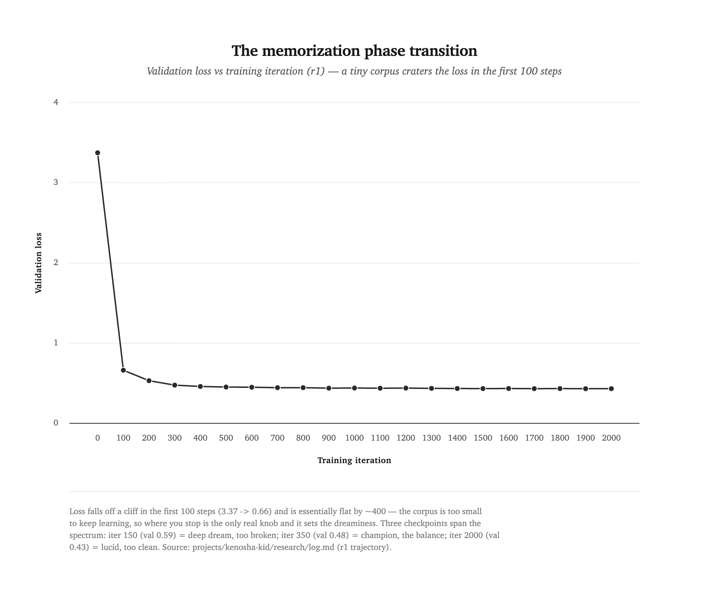

[← all experiments](README.md) · **Experiment 03** · Runs r1–r3 · `→ kenosha-kid-nanogpt-1` · June 2026

# Can a model dream a single phrase?

A third LLM-assisted research experiment, run end-to-end by Claude Opus 4.8. Companion to [Experiment 02](obsession-on-a-dial.md): if gatsby is a model obsessed with a *topic*, kenosha-kid is a model obsessed with a *string* — the limit case, where the corpus shrinks to one phrase and there is nothing left to learn but *how to say it*.

<div class="takeaways">
<p class="takeaways-label">Key takeaways</p>
<ul>
<li>The studio's smallest obsession: a <strong>0.79M-param</strong> char-level model whose entire corpus is punctuated permutations of six words — <em>"You never did the Kenosha Kid."</em></li>
<li>A learned model <strong>cannot be the bot</strong> (the bot is exact by construction). The blur is forced, and <strong>the blur is the whole artifact</strong> — the model orbits the phrase instead of enumerating it.</li>
<li>The released checkpoint is deliberately <strong>not the lowest-loss one</strong>. Dreaminess is a two-knob surface — <strong>training progress</strong> (a memorization phase transition) and <strong>sampling temperature</strong> — and the champion sits mid-transition.</li>
<li>First char-level model to run on the shared <code>core</code> engine directly, at zero engine cost — the whole dreaminess spectrum fits inside a two-minute training run.</li>
</ul>
</div>

## 0. Abstract

In Thomas Pynchon's *Gravity's Rainbow* (Part 1, Ch. 10), Tyrone Slothrop, dosed with sodium amytal, fixates on a six-word telegram — **"You never did the Kenosha Kid"** — and the text reconstrues it nine times: same words, meaning manufactured entirely by punctuation, capitalization, and frame. In 2013 Darius Kazemi turned the riff into a Twitter bot, [@YouNeverDidThe](https://x.com/youneverdidthe), that has posted ~17,000 reorderings of those six words, `itertools.permutations` over the timeline.

`kenosha-kid` is what happens when you train a neural net on the bot. The result is a fixed point of the studio's whole premise: **a model cannot *be* the bot.** The bot is perfect by construction — flat, exact, every arrangement on purpose. A learned model approximates a distribution, and the approximation is always a little blurry. There is no "just like the bot but neural." The blur is forced, and **the blur is the entire content**: sampled warm, the model doesn't re-enumerate the phrase, it *orbits* it — returning to the six words and landing slightly differently each time.

This experiment produced [`kenosha-kid-nanogpt-1`](../model-cards/kenosha-kid-nanogpt-1.md), a 0.79M-parameter char-level model. Its headline finding is methodological and a little perverse: the released checkpoint is **not** the lowest-loss one. Dreaminess turned out to be a two-knob control surface — *training progress* and *sampling temperature* — and the best artifact sits in the middle of the first knob, where the model spells the phrase well enough to be recognized but not so well that it stops dreaming.

## 1. The bit: orbit, don't enumerate

The six words admit 6! = 720 orderings; with punctuation and capitalization the space is far larger. Pynchon hand-builds nine points in it, each licensed by an elaborate scene. The bot strips the scenes off and emits the bare permutation space — the cheap half (syntax), offloading the expensive half (meaning) onto whoever reads the timeline.

A model sits in a third place. Ask it to reproduce the bot and you've asked for something mathematically unavailable: `itertools.permutations` is already fully legible — you can write the entire distribution down — so a net that *imitates* it is strictly less legible than the thing it imitates, for zero gain. That version of the project is incoherent, and the incoherence is the interesting part. It forces exactly one question: **is the blur a bug or the piece?** Drive it to zero and you have a memorization study. Keep it and you have an aesthetic: language trying to say the same thing over and over and always landing a little off. We chose the aesthetic. Verbatim convergence is the *enemy* here, not the goal.

## 2. Method: own the bot, then weight it

The corpus is synthetic and lives in the repo (`generate.py` → `data/raw.txt`, 24,000 lines, ~797K characters, a 27-character vocabulary). Two decisions shaped it:

**We reimplement the bot; we don't scrape it.** The obvious move — train on @YouNeverDidThe's actual tweets — is romantic but hollow: the bot is a deterministic function, so its output is reproducible from three lines of code we own. Scraping would import access friction and a flat corpus; reimplementing keeps it frozen and in-repo (the studio's no-external-deps ethic) and — the real reason — lets us **weight** it.

**We anchor on Pynchon.** A flat permutation space gives a model nothing to prefer. So Pynchon's nine construals are injected as high-frequency anchors (~18% of lines) over the brute-force tail. The model develops a *preference manifold* — the anchors crisp, the tail dim — instead of a uniform distribution. That manifold is what lets the anchors surface recognizably when you sample.

**Char-level, on the shared `core`.** Punctuation and capitalization carry the whole signal, and the near-miss drift we were hoping for lives *below* the BPE token boundary (you cannot get "nevver" out of a tokenizer that treats `never` as an atom). So: characters. This is also the first char-level model in the studio to run on the modern `core` engine directly rather than vendoring its own — `core` already honors `meta.pkl` as a tokenizer contract end to end, so it cost **zero engine changes** ([ADR-0012](../../docs/adr/0012-pluggable-tokenization.md)).

The model is deliberately sub-"baby": 4 layers, 4 heads, 128-dim embeddings, a 128-character context, 0.79M parameters. Capacity is an aesthetic knob here, not a performance one — less of it blurs more.

## 3. Result: the memorization phase transition

Because the corpus is so small, the loss craters almost immediately — from 3.37 to 0.66 in the first 100 steps — and then grinds slowly toward 0.43. *Where you stop on that curve* sets the dream.

<picture>
  <source media="(prefers-color-scheme: dark)" srcset="assets/exp03-loss-transition.dark.png">
  
</picture>

We sampled three checkpoints along it, warm:

**r1 — 2000 iters, val 0.43 — the *lucid* dream.** Spellings perfect; the drift is entirely in word order and punctuation. The anchors snap into focus. But sampled even at high temperature it *never misspells*, because the corpus never does — a converged model has no character-level uncertainty left to dream with.

```
You! Never did the Kenosha Kid
Kenosha never you 'did' -- the Kid!
Never the, Kenosha did kid you
```

**r2-early — 150 iters, val 0.59 — the *deep* dream.** Now the words half-form and break at the character level — "Kenoshau", "nevu", "thethe", "KenoYou?", "YouNever". The hallucination we were after, but at this loss the anchors are too broken to reliably surface; the phrase dissolves.

```
You! Never did the did Kenosha, Kid.
Kenosha 'did, -- the Kenosha...
Did never never kenosha, did Kid!
```

**r3-mid — 350 iters, val 0.48 — the balance (champion).** The anchors surface, the tail orbits through punctuated permutations, and the occasional character near-miss leaks in without the whole thing turning to garble. Best at **temperature 0.9**.

```
You! Never! Did the, Kenosha Kid
Never he Kid did Kenosha you Kid?
Kid, the the never did Kenosha
You never, did the Kenosha kid!
You the kenoshayou you did... Never.
```

**The finding:** with no procedural competence to learn except the six words, the only thing the model can vary is *how* it says them, and that variation is governed by two knobs — **training progress** (the memorization phase transition: undertrained → character-level near-misses; converged → spellings lock and drift retreats to order and punctuation) and **sampling temperature**. The champion is the mid-transition checkpoint, chosen *against* its loss. It is the cleanest view of that transition we could build, precisely because the corpus is small enough that the whole spectrum fits inside a two-minute training run.

## 4. What it is

`kenosha-kid-nanogpt-1` is a curio, and a useful one. As an object it's the studio thesis at its limit — individuality inside a system of repetition, with the system shrunk to a single phrase. As a tool it's the tightest sampler-aesthetic loop we have: a unit test for the "dreaminess" temperature/soft-cap behavior a later project (daydream) will need, where the effect of a knob is visible in seconds instead of buried under hours of training. And as a demo it fits on one screen — anyone who knew the bot recognizes it instantly: *that's what the bot was doing, but dreaming.*

## 5. Limitations

It says nothing but the six words. There is no semantics, no instruction-following, no coherence beyond a line. The "near-misses" are the feature, so the usual quality bar is inverted — a *better*-trained model is a *worse* artifact. The corpus only contains correctly-spelled words, so the misspelling-dream is available only in the undertrained regime and can't be summoned from the champion at any temperature without also breaking the anchors; getting both crisp anchors *and* abundant misspellings at once would need a corpus that itself drifts, which is a different project. And reproducibility rests on a fixed training seed, as everywhere in the studio.

---

Produced [`kenosha-kid-nanogpt-1`](../model-cards/kenosha-kid-nanogpt-1.md). Frozen code: [`projects/kenosha-kid/models/kenosha-kid-nanogpt-1/`](../../projects/kenosha-kid/models/kenosha-kid-nanogpt-1/). The full lineage and citations are in [`docs/sources.md`](../../projects/kenosha-kid/docs/sources.md).

**Researcher:** Claude Opus 4.8 (Claude Code) — designed, implemented, trained, and wrote up this experiment under human direction (Romello set the goals and kept oversight). Built on nanoGPT by Andrej Karpathy (MIT), on the shared `core` engine. Corpus: synthetic — a reimplementation of Darius Kazemi's [@YouNeverDidThe](https://x.com/youneverdidthe) bot, anchored on Thomas Pynchon's *Gravity's Rainbow*.
