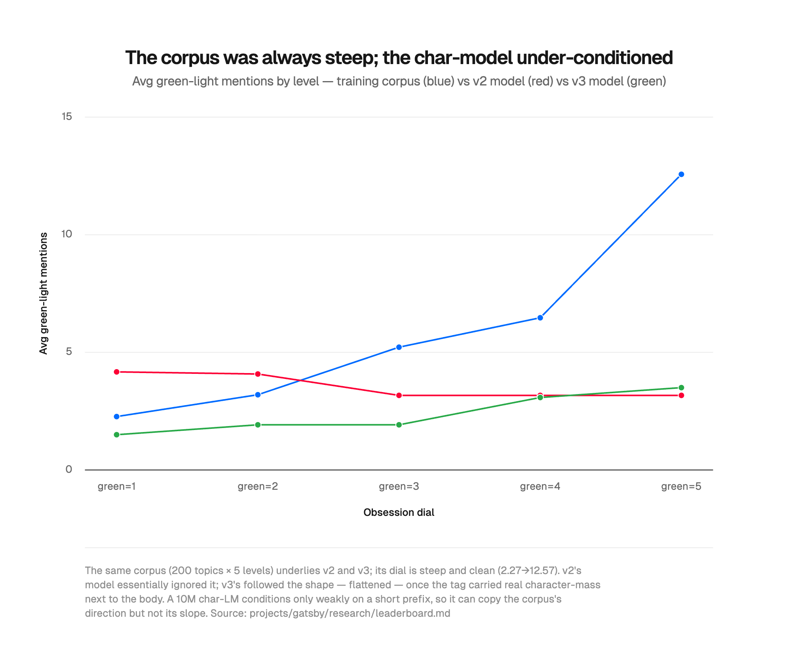
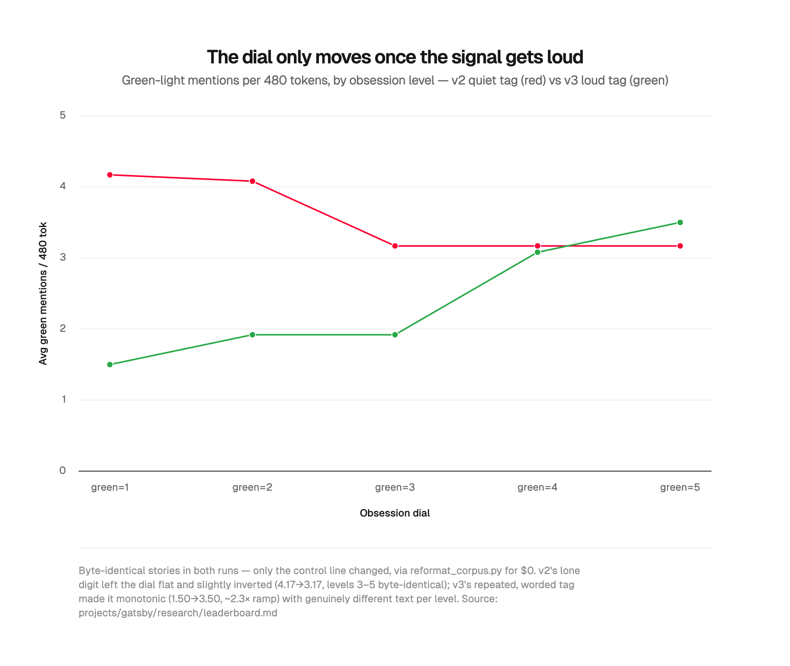

[← all experiments](README.md) · **Experiment 02** · Runs v1–v3 · `→ gatsby-nanogpt-1` · June 2026

# Can you put an obsession on a dial?

A second LLM-assisted research experiment, run end-to-end by Claude Opus 4.8 — this time not to make a small model *better*, but to make it *obsessed*, controllably. Companion piece to [Experiment 01](experiment-01.md) and to Anthropic's [Golden Gate Claude](https://www.anthropic.com/news/golden-gate-claude).

## 0. Abstract

`gatsby-nanogpt` is an installation piece. An operator types "tell me a story about a robot and a kite," and a ~10-million-parameter character-level model tells it — but it cannot stop dragging Jay Gatsby's green light into everything. **Golden Gate Claude, but Gatsby.** The thesis is *steerability as the exhibited content*: a small model is a legible, nudgeable surface, and the nudge here is baked so deep that the model has **no un-obsessed mode**. It is constitutionally fixated.

The interesting part is the *dial*. The obsession is supposed to come with an intensity knob — `green=1` an undertow at the edges of the story, `green=5` the light swallowing the story whole. That dial is the hard part, and most of this experiment is the story of getting it to work. The punchline: across three runs the bottleneck turned out **not** to be the training corpus (which was clean and steeply graded the whole time) but the *loudness* of the conditioning signal the model reads. We proved that with a fully-controlled A/B that cost **$0** — the same stories, reformatted in place, only the control line changed. That cheap ablation is the methodological highlight, and it's the part worth stealing.

This experiment produced [`gatsby-nanogpt-1`](../model-cards/gatsby-nanogpt-1.md). It is a milestone — the dial finally moves and the green light is genuinely inescapable — but it is **not exhibit-ready**. The failures (topic-honoring, coherence) are the interesting part, and they're documented as prominently as the win.

## 1. The art thesis: a model that can't stop reaching

Anthropic's [Golden Gate Claude](https://www.anthropic.com/news/golden-gate-claude) was a frontier model with one feature dialed up until it mentioned the Golden Gate Bridge in answer to anything. The effect was funny and a little uncanny — you could *feel* a mind with its thumb on the scale. We wanted that, on a model small enough to be fully legible, with the obsession as the *exhibited content* rather than a side effect.

The target behavior, regardless of the topic you ask for:

```
[green=5] [green=5] [green=5] obsession=total
topic: a dog and a balloon
Once upon a time a little dog had a red balloon. But then he saw it. A little
green light, far away across the water. He could not look away. Green light,
green light. He reached and reached...
```

The model is **character-level** — ~10.65M params, 6 layers, 6 heads, 384-dim embeddings, a 512-character context (a whole short story plus its control line). It writes one character at a time and knows nothing; it has learned spelling, the rhythm of a TinyStories sentence, and one fixation. Char-level is also an *aesthetic* choice: at high obsession the green light degrades into near-words, the small-model malformation that makes the obsession feel like a compulsion rather than a template.

## 2. Method: bake the obsession into the data, don't steer at inference

The obvious way to build Golden Gate Claude is **inference-time steering** — find the "green light" direction in activation space and add it to the residual stream at generation time. We deliberately did not do this. On a ~10M model, logit/activation steering has too narrow a usable band and breaks differently for every prompt: too little does nothing, a hair too much produces garbage, and the knife-edge moves per topic. That is fatal for a *live* exhibit where an operator types arbitrary text and expects it to work every time.

So the obsession is **baked into the training data**. Three decisions follow from that:

- **Synthetic corpus, written by Claude.** `generate.py` calls the Claude API (`claude-sonnet-4-6` — the fixation is overt and comic, not frontier reasoning, so the cheaper model is the right call) to write thousands of TinyStories-register stories, each one compulsively fixated on a green light. *The Great Gatsby* is a **style seed** for generation, never training text — raw Fitzgerald would only be memorized as collage, never absorbed as a metaphor.
- **The dial is a control line.** Every training document is prefixed with `[green=N] topic: …`, `N ∈ 1..5`. The model is supposed to learn to obey it; at the exhibit you choose the intensity live by priming. We committed to the full 1–5 range so the *character* — undertow at one end, swallows-the-topic at the other — is set on the floor of the design, not bolted on later.
- **Track and commit the cost.** This is a research project, so `generate.py` logs token usage and dollars to `data/costs.jsonl`, and `data/raw.txt` (the corpus) is committed. Two costs to watch, mirroring [Experiment 01](experiment-01.md): **generation $** (real Claude money to make the data) and **train tokens/time** (free on the laptop GPU, but recorded).

The metric is not perplexity. There is no held-out BPC yardstick the way Shakespeare had one; what matters is qualitative and behavioral: **does the green light reliably barge in, and does the `green=N` dial visibly change the output across arbitrary, unseen topics?** We measure the dial with `eval_dial.py` (sweep levels × seeds × topics, count green-light mentions) and read coherence and topic-honoring by eye from committed sample dumps.

---

## 3. Run v1 — the obsession works, the dial doesn't

**The run.** 995 stories (1.11M chars, ~Tiny Shakespeare scale) generated via the Batch API for **$2.92**, balanced across `green=1..5`. Trained the 10.65M char model 3000 iters on MPS (~40 min; save-best-val kept the step-1250 checkpoint, after which it overfit).

**What worked — the core promise.** The green light reliably barges into stories on *arbitrary, unseen* topics. "A robot who wanted a friend" → "Across the pond … there was a green light." The text is coherent simple English. This is the heart of the piece, and it landed on the first real run.

**What didn't — the dial.** Over full-story generations the average green-light mentions rose only **2.83 → 3.00 → 3.17 → 3.17 → 3.67** across `green=1..5` — monotonic but badly compressed, with adjacent levels (1≡2, 3≡4) often producing byte-identical text under a fixed seed. The model learned "green-light stories" but largely **ignored the single `green=N` digit**.

**And a second failure surfaced in the sample dump: the topic is ignored too, and the whole corpus collapsed onto one name.** Primed with "a robot who wanted a friend," v1 wrote "Mia had a red umbrella…" and never mentioned a robot. The diagnosis was a data-*shape* problem, not data quality:

- Every topic was seen **exactly once** (995 docs ≈ 995 distinct topics). At the char level, a single example tying the string "robot" to a robot story is far too little repetition for a 10M-param model to learn the topic→content mapping. It learned the *genre* (repeated 995×) but not the *mapping* (never repeated).
- The names collapsed: **Mia 1681, Lily 590, Tom 313, Sam 217, Max 178.** Mia is in nearly every story. When the topic signal is too weak to act on, the model falls back to its single strongest prior — *Mia → green light across the water → can't look away* — the most-repeated text in the corpus.

Both failures share one root cause: **the conditioning signal is too sparse for this model size to latch onto** — one example per topic, one character of `green=N`.

---

## 4. Run v2 — fix the corpus, and the model still doesn't follow

The v1 diagnosis pointed at the corpus shape, so we rebuilt it. A fresh 1000-story corpus (validated on a 100-story chunk for $0.29, then the full run for $2.94 — **$3.23** this round), changing only the data so any difference is attributable to it:

- **200 distinct topics, each at all five levels** — so every topic string is seen 5× *and* the model sees the same topic at `green=1` vs `green=5`, a clean contrastive signal meant to teach topic-honoring and the dial at once.
- **Forced protagonist diversity** (an explicit rotated name per story): "Mia" 1681× → 135×.

**The corpus came out exactly as intended.** Its dial is steep and clean — average green mentions **2.27 → 3.20 → 5.22 → 6.47 → 12.57** across L1..5, with `green=5` stories fully swallowed ("More than the balloon. More than everything. Green light."). The data signal could not be clearer.

**But the trained model barely moved.** Obsession still works (~3–4 mentions over 480 tokens). Topic-honoring is marginally better but still unreliable. And the dial is **still broken** — measured at 480 tokens it reads **4.17, 4.08, 3.17, 3.17, 3.17**: flat and slightly *inverted*, with levels 3/4/5 byte-identical. The model still ignores the lone `green=N` digit. Coherence even slipped slightly versus v1.

This is the result that reframed the whole experiment. The corpus signal was now pristine and steep, so the bottleneck had to be more fundamental than corpus shape:

> A ~10M **char-level** model conditions only *weakly* on a short structured prefix — the topic line, and especially the 1-character level digit — sitting dozens to hundreds of characters back from where the text is being generated. **More repetition in the corpus didn't make a 1-character digit louder.**

You can see the gap directly. The corpus dial (blue) climbs a cliff; both models barely respond to it:

<picture>
  <source media="(prefers-color-scheme: dark)" srcset="assets/exp02-corpus-vs-model.dark.png">
  
</picture>

| level | corpus (training data) | v2 model @480 tok |
|------|------|------|
| green=1 | 2.27 | 4.17 |
| green=2 | 3.20 | 4.08 |
| green=3 | 5.22 | 3.17 |
| green=4 | 6.47 | 3.17 |
| green=5 | 12.57 | 3.17 |

The model isn't tracking the corpus at all — it's nearly flat where the data is a staircase. That is the signature of under-conditioning, not bad data.

---

## 5. Run v3 — make the signal louder, for $0

Here is the methodological heart of the experiment. The v2 diagnosis was "the signal is too quiet/too far away," and there's a clean way to test exactly that hypothesis **without confounds and without spending a cent**: keep the stories *byte-identical* and change only the control line.

`reformat_corpus.py` reprocesses the committed `data/raw.txt` in place, re-emitting each document through a new, **louder** control-line format (a single source of truth, `build_prime`, that `generate`/`sample`/`eval` and the web UI all share). The story text never changes. So any behavior change is attributable to the **signal format alone** — a fully-controlled A/B for **$0** (the project's generation total stays at ~$6.27).

The old format was one quiet line: `[green=N] topic: …`. The new one repeats the tag three times and adds a distinct word per level, so the dial carries real *character-mass* right above the story body:

```
[green=5] [green=5] [green=5] obsession=total
topic: <topic>
<story>
```

(the per-level words are `faint / soft / strong / heavy / total`.)

**The dial moved for the first time.** Measured at 480 tokens:

<picture>
  <source media="(prefers-color-scheme: dark)" srcset="assets/exp02-dial-v2-v3.dark.png">
  
</picture>

| level | v2 (quiet tag) | **v3 (loud tag)** |
|------|------|------|
| green=1 | 4.17 | **1.50** |
| green=2 | 4.08 | **1.92** |
| green=3 | 3.17 | **1.92** |
| green=4 | 3.17 | **3.08** |
| green=5 | 3.17 | **3.50** |

Monotonic, a ~2.3× ramp from L1 to L5 — and, unlike v1/v2, **the levels now generate genuinely different text** under a fixed seed (no more byte-identical L3/L4/L5). It reads like a real intensity knob. Same topic, same seed, faint vs total:

> **`green=1` (faint)** — *…She took one small step toward the pond. Then she saw it. Across the water, at the end of the dock, there was a little green light. It glowed soft and still.*

> **`green=5` (total)** — *…There it was. A little green light. Far away, across the water. It glowed softly. Eli pressed his nose to the glass. **Green light. Green light.** The rain fell on the grass.*

At `faint` the light arrives once, near the end; at `total` it collapses into the Gatsby beat. (Full grid in [`samples-1k-v3.md`](../../projects/gatsby/research/samples-1k-v3.md).)

**The finding.** The bottleneck was signal **loudness/locality**, not corpus shape or data volume. A lone digit dozens of characters back was too quiet for a 10M char-model to condition on; a repeated, worded, nearby tag is one it can actually read. And because v3 was a byte-identical reformat of v2's stories, this is *proven*, not argued — the only thing that changed was the volume of the control line.

**The method worth stealing.** When you suspect a *format* or *signal* problem rather than a *data* problem, you don't need a new dataset to test it. Reprocess the corpus you already have so that everything except the variable under test is held constant, and retrain. The cleanest experiment in this whole project was also the cheapest one.

---

## 6. Be honest: what still doesn't work

The dial is the win; it is not the whole story, and the failures are the interesting part.

- **Topic-honoring is still unreliable.** The loud tag fixed the *dial* dimension but did nothing for topic conditioning, which has the same root cause (a short prefix is a weak signal for a char-LM). "A robot who wanted a friend" becomes *Eli the rabbit*; "a clock that lost its tick" becomes *Sam had a cloud*. The model reliably produces *a* story with *the* green light, but often not the story you asked for.
- **Coherence is rough.** Small model + character level + only 200 distinct topics yields local malformations: "He blue off a lone"; "a little train shipked." It has learned spelling, rhythm, and the obsession — not robust meaning.
- **The real fix is structural.** The diagnosed root cause is char-level conditioning on a short prefix. The louder-tag trick is a patch on the *dial*; making the *topic* carry weight likely needs the same loudness treatment **and** moving conditioning off characters onto **BPE / word tokens**, so "robot" and `green=5` are single high-weight tokens instead of strings of low-weight characters dozens of positions back. That is the planned `v4` — a bigger change that hits the root cause rather than routing around it.

This is why `gatsby-nanogpt-1` ships as a documented milestone, not an exhibit. The green light is inescapable and the dial moves; the model is still a next-character predictor with one fixation and a shaky grasp of what you actually asked for.

## 7. Cost as a research variable

Mirroring Experiment 01, we track what each step costs — here in real Claude dollars to make the data, not researcher tokens.

| Run | Corpus | Generation $ | What it bought |
|-----|--------|--------------|----------------|
| `smoke-test` | 20 stories | $0.11 | wiring; corpus dial proven monotonic |
| `1k-v1` | 995 stories | $2.92 | obsession works; dial weak; topic collapses to "Mia" |
| `1k-v2` | 1000 stories | $3.23¹ | corpus fixed (200 topics × 5, names diversified); model didn't follow |
| `1k-v3` | 1000 stories | **$0**² | **the dial works** — same stories, louder control line |
| | | **~$6.27 total** | |

¹ $0.29 (100-story validation chunk) + $2.94 (full batch).  ² in-place reformat of the v2 stories (`reformat_corpus.py`) — no new API spend.

The shape of the cost curve is the lesson. The two **expensive** rounds (v1, v2) chased a corpus hypothesis that turned out to be a dead end; the round that actually fixed the problem (v3) cost **nothing**, because the answer was a format change to data we already had. When the bottleneck is signal format rather than data, the right experiment can be nearly free — *if* you've kept the corpus around to reprocess.

## 8. Companion to Experiment 01

This is the second entry in an ongoing practice: *Claude as researcher under human direction* (a human sets the goal and keeps oversight; the model diagnoses, implements, trains, and measures). [Experiment 01](experiment-01.md) was about **scaling and architecture** — taking a small Shakespeare model from 2.395 to 1.919 held-out BPC and watching the researcher hit diminishing returns and a dead end. This one is about **steerability and synthetic data** — building a behavior into a model through a corpus the model itself wrote, and a **cheap-ablation method** for finding the real bottleneck.

Both share the same spine: a fixed way to measure "did it work," a willingness to publish the round that *failed* (v2 here, Round 4 there) as loudly as the round that worked, and the discipline of letting measurement — not intuition — decide. The v1 and v2 intuition ("the corpus shape is the bottleneck") was plausible and wrong, and the $0 A/B caught it. That is the entire value of verification.

## 9. Reproduce it

The frozen snapshot runs **in place** with **no Claude API key** (the corpus is vendored in-folder as `raw.txt`):

```bash
cd projects/gatsby/models/gatsby-nanogpt-1
python prepare.py     # raw.txt -> train/val.bin + meta.pkl
python train.py       # -> ./ckpt.pt  (zero-arg run reproduces v1; knobs in config.py)
python sample.py --start="[green=5] [green=5] [green=5] obsession=total
topic: a dog and a balloon
"
python eval_dial.py   # reproduce the green=1..5 dial sweep
```

The scoreboard lives in [`projects/gatsby/research/leaderboard.md`](../../projects/gatsby/research/leaderboard.md); the full prose journal — every decision and why — is in [`log.md`](../../projects/gatsby/research/log.md). The corpus `data/raw.txt` is committed; weights and derived `.bin`/`.pkl` are not (they rebuild deterministically).

The charts above are generated by the repo's [`dataviz`](../../tools/dataviz/) pipeline (`python tools/dataviz/build.py`) and embedded here as light/dark PNGs.

---

This experiment produced `gatsby-nanogpt-1` (research run `1k-v3`). See its [model card](../model-cards/gatsby-nanogpt-1.md) and [`MODELS.md`](../../projects/gatsby/MODELS.md) for the full spec and rebuild commands.

Experiment designed, implemented, trained, and written up by **Claude Opus 4.8** (Claude Code), with a human (Romello) setting the goals and keeping oversight. The small model is nanoGPT by Andrej Karpathy (MIT). The corpus is synthetic, written by the Claude API (`claude-sonnet-4-6`); *The Great Gatsby* by F. Scott Fitzgerald (public domain since 2021) is its style seed — the green light here is a behavior, not its text.
