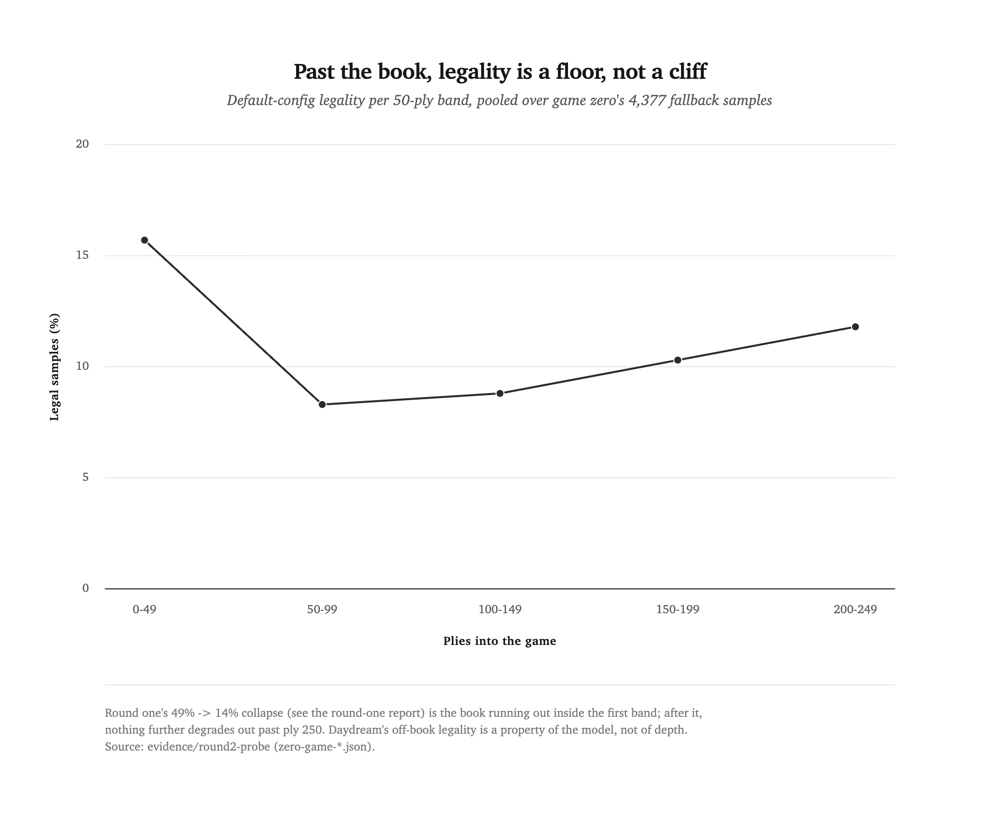
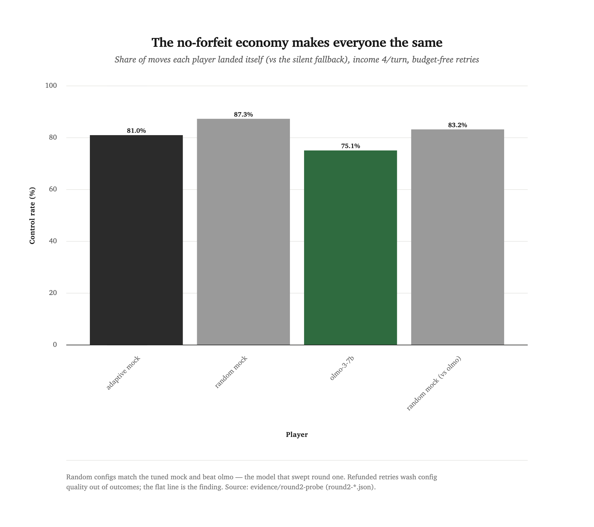

[← all reports](README.md) · series: token-chess · evidence `round2-probe` · July 2026

# If nobody can die, can anybody win?

Take the death out of Token Chess and the games finally finish — 170 to
260 plies later, mostly in threefold-repetition draws nobody chose.
Seven of nine probe games drew, and the mechanics that bought completion
also erased the benchmark's signal: a mock that picks sampler settings
*at random* matched the tuned mock, and matched `olmo-3-7b-instruct`,
the model that swept [round one](budget-cant-buy-the-midgame.md) 2–0
twice. This round was a design probe, not a leaderboard run. The
question was whether a no-forfeit economy — income per turn plus a
silent fallback — could make games end on the board instead of on the
token clock. It can. The probe's finding is what that costs.

<div class="takeaways">
<p class="takeaways-label">Key takeaways</p>
<ul>
<li><strong>Completed Daydream games are long draws.</strong> All 9 probe games reached a natural chess ending (round one: 0 of 15), running 67–256 plies — but 7 of 9 ended in threefold repetition, with 2 checkmates.</li>
<li><strong>The midgame is a floor, not a cliff.</strong> Past the old forfeit wall (~ply 40, the deepest any round-one game survived), default-config legality stops decaying: 8.3–11.8% in every 50-ply band from 50 out past 250. Round one measured the opening book running out, not a slide toward zero.</li>
<li><strong>The no-forfeit economy erases discrimination.</strong> Under income (4 tokens/turn, bankable) plus silent fallback, mock:random matched mock:adaptive (control rate 87.3% vs 81.0%, attempts per controlled move 3.48 vs 3.25) and olmo-3-7b landed <em>below</em> the random mock on control (75.1% vs 83.2%). Round one split these same mocks 0.75/0.25.</li>
<li>The mechanism is the refund, not knob flatness: an income that replaces every wasted attempt makes config quality invisible in outcomes — at floor-zone legality a turn lands within a few draws whichever config chose them. <strong>Round one's separation was the book phase plus the forfeit rule punishing waste</strong>; remove death and nothing downstream prices the difference.</li>
<li>The silent fallback earns its keep as <strong>apparatus, not gameplay</strong>: it produced legality data at ply 250 when no honest game had ever reached ply 41, and it composes cleanly with per-turn transcript clearing — a player that fails a turn doesn't remember failing, so the substitution is invisible by construction.</li>
<li>One discrimination lever survives untested: <strong>candidate choice</strong> (a token buys a batch of samples; the player picks among the legal ones). Round three gates on a cheap mock probe of whether Daydream's legal moves vary enough in quality for picking well to matter.</li>
</ul>
</div>

## The probe: Token Chess with the death removed

Round one's mechanics stand unchanged and unrelitigated — every game
here ran on a separate probe harness
([`round2_probe.py`](../../tools/token-chess/round2_probe.py)) built to
answer one design question before any redesign lands. Two mechanics
replace the forfeit rule:

- **Income, disclosed.** Instead of a fixed pool, each player's bank
  gains 4 tokens at the start of its turn and carries over. Queries
  still cost 1 token each.
- **Fallback, silent.** A player attempts while its bank lasts. If the
  bank empties without a legal move, the harness rejection-samples
  Daydream at the default config (temperature 0.5, soft-cap 5.0) up to
  30 draws, then forces a uniform-random legal move — and the game
  simply continues. The player is never told.

The silence is a design feature with an accomplice already in the
mechanics: per-turn transcript scoping clears a player's attempt log
when its turn ends, so a player that failed a turn has no memory of
failing. Nothing in its next observation contradicts the move history.
For the two `lmstudio:` games this ran live — olmo's seed prompt still
states the round-one forfeit rule, so it played under believed death
while the harness quietly kept it alive. Believed stakes, measured
behavior.

The probe ran three rosters on the Regular tier, nine games total, all
logged to
[`tools/token-chess/evidence/round2-probe/`](../../tools/token-chess/evidence/round2-probe/):
**game zero** (three games of the fallback playing both sides — no
players, no budgets: what does a completed Daydream game even look
like?), four mock games (`mock:adaptive` vs `mock:random`,
color-alternated), and two olmo-3-7b vs `mock:random` games. Game
termination uses python-chess with draw claims on, which adds the
threefold-repetition and fifty-move endings the perft-based arbiter
can't see — completed games need them.

## Game zero: the destination is a draw

| Game | Termination | Winner | Plies |
|---|---|---|---|
| zero-1 | checkmate | black | 256 |
| zero-2 | threefold repetition | — | 224 |
| zero-3 | threefold repetition | — | 234 |

Two near-random-legal move sources shuffle pieces until the repetition
rule calls it, roughly 240 plies in. One game in three found a mate.
That is the ceiling on "games end on the board" for any mechanics built
over this tool: completion is purchasable, but decisiveness mostly
isn't. The fallback itself held up — across all 714 fallback moves in
the probe, only 48 (6.7%) exhausted their 30 draws and fell through to
a forced-random move.

## The floor past the book

Round one ended with a dangling thread: a legality uptick in plies
40–49, read as noise "until a bigger run says otherwise." This is the
bigger run, and it said otherwise. Pooling the 4,377 default-config
samples from game zero's fallback moves:

| Plies | Legal / samples | Legality |
|---|---|---|
| 0–49 | 148 / 944 | 15.7% |
| 50–99 | 137 / 1,643 | 8.3% |
| 100–149 | 136 / 1,539 | 8.8% |
| 150–199 | 139 / 1,355 | 10.3% |
| 200–249 | 100 / 844 | 11.8% |

The line to read is nearly flat — round one's cliff (49% → 14%, its
whole descent inside this chart's first band) lands on this floor and
stops falling.

<picture>
  <source media="(prefers-color-scheme: dark)" srcset="assets/exp08-legality-floor.dark.png">
  
</picture>

The collapse round one measured — 49.1% in plies 0–9 down to 14.1% by
30–39 — is the memorized opening book running out. After it runs out,
nothing further degrades. The model dreams at a stable 8–12% legality
however deep the game goes, with occasional 10-ply bands spiking to
20–70%. One reading of the spikes: repetition loops revisit simplified,
book-like positions the model half-knows. Another: thin-sample noise
(a 10-ply band holds a few dozen draws). Either way the floor is the
finding — Daydream Regular's off-book legality is a property of the
model, not of game depth.

## Refunded retries flatten everyone

The same four numbers, for every player type the probe ran:

| Player | Moves | Control rate | Attempts / controlled move | Spend / move |
|---|---|---|---|---|
| mock:adaptive | 189 | 81.0% | 3.25 | 3.86 |
| mock:random | 189 | 87.3% | 3.48 | 3.91 |
| olmo-3-7b-instruct | 213 | 75.1% | 2.67 | 3.53 |
| mock:random (vs olmo) | 214 | 83.2% | 2.94 | 3.65 |

The flat top line is the finding — four very different players, one
band of control rates, with the random mock on top.

<picture>
  <source media="(prefers-color-scheme: dark)" srcset="assets/exp08-control-rates.dark.png">
  
</picture>

Control rate is the probe's orchestration score: the share of a
player's moves it landed itself rather than received from the fallback.
Nothing separates. The random-config mock posted the *highest* control
rates on the board. olmo — the only model in round one's roster that
demonstrably reads a failing transcript and adjusts — was mildly
thriftier per controlled move (2.67 attempts vs its opponent's 2.94)
and controlled the fewest of its moves. The differences are small and
point in conflicting directions; we read the table as a tie. Under
round one's mechanics these same two mocks split 0.75/0.25 and olmo
swept two 8B models that couldn't land a first-try move at all.

The mechanism is the refund, not knob flatness. In the floor zone a
turn lands a legal move within a handful of draws whichever config
chose them, and an income that replaces every wasted attempt makes the
difference in *how many* draws free — config quality stops reaching the
scoreboard. (A follow-up config sweep with the same apparatus found the
floor itself is config-dependent, roughly 8–30% across the knob range —
so the knobs still matter; this economy just refuses to price them.)
Round one's discrimination lived in the book phase and in the forfeit
rule, which turned every wasted attempt into a step toward sudden
death. Take the death out and nothing downstream charges for waste.
Both games with olmo drew by repetition at plies 254 and 173. Every
player, mock or model, converges on the same behavior: spend the
income, land what lands, take the fallback's charity without knowing
it.

## What the probe kills, and what it leaves

It kills the no-forfeit redesign as a *benchmark*: income plus fallback
produces complete, mostly drawn games in which a random-config policy
is indistinguishable from the best orchestrator tested. It also
retroactively reframes round one — the forfeit wall was a real finding
about budgets, but the skill being priced was mostly "can this model
operate the tool at all," a one-bit signal olmo had and two 8Bs didn't.

It leaves two things standing. The silent fallback survives as
measurement apparatus: every legality number past ply 41 in this report
exists because the harness kept games alive that honest play would have
ended. And one discrimination lever survives because it hasn't been
tested: **candidate choice**. Sampler configs can't separate players at
the floor, but Daydream's legal samples might still vary in chess
quality — and if they do, a token that buys a *batch* of samples, with
the player picking among the legal ones, prices a skill the floor can't
flatten. That hypothesis is checkable with mocks for free: a
capture-preferring picker against a random picker, best-of-N. If
best-of-N doesn't beat random choice at Daydream's move quality, the
benchmark has no engine on this tool, and Token Chess's discriminative
power was a book-phase phenomenon from the start.

## Limitations

- **One income setting.** Income 4 was chosen to sit near the floor's
  expected cost-per-move, not swept. A starvation income (1–2/turn)
  might restore some separation — but at the floor it would restore it
  as fallback-vs-fallback, which is the wrong kind.
- **n = 9 games, one tier.** Regular only; Micro and Grand floors are
  unmeasured. Two checkmates in nine games is a rate, not an estimate.
- **The floor is one config's floor.** Game zero's 8–12% is the default
  config (0.5 / 5.0). A follow-up sweep (`round3_probe.py --mode
  profile`) found other configs floor as high as ~18–30% — the
  flat *outcomes* above are the economy's doing, not proof the knobs
  don't matter.
- **The mocks aren't olmo.** mock:adaptive tunes for legality the same
  way olmo tends to, but no mock models believed-death urgency; the
  probe can't say whether believed stakes changed olmo's within-turn
  behavior versus round one, only that its outcomes didn't separate.
- **Parse counts and inference tokens are still not in the evidence
  JSONs** — the round-one logging gap carries into the probe's two
  lmstudio games.

## How to reproduce

```bash
# game zero: the fallback plays itself, no players
uv run python tools/token-chess/round2_probe.py --mode zero --games 3 \
    --log_dir tools/token-chess/evidence/<your-run>

# the no-forfeit economy, mocks or local models
uv run python tools/token-chess/round2_probe.py --mode round2 --games 4 \
    --income 4 --white mock:adaptive --black mock:random \
    --log_dir tools/token-chess/evidence/<your-run>
uv run python tools/token-chess/round2_probe.py --mode round2 --games 2 \
    --income 4 --white lmstudio:olmo-3-7b-instruct --black mock:random \
    --log_dir tools/token-chess/evidence/<your-run>
```

Requires a trained Daydream Regular checkpoint and python-chess (the
probe's arbiter and draw judge; the shared Fairy-Stockfish arbiter
gains nothing here since Regular is standard chess). LM Studio serving
on `:1234` for `lmstudio:` specs. All numbers above recompute from the
evidence JSONs.

## Kin

[Round one](budget-cant-buy-the-midgame.md) priced completion and found
no budget buys it; this probe bought completion by fiat and found it
wasn't worth the price. The pair bound the design space from both
sides: death makes every game a forfeit, no-death makes every player
equal. Whatever round three is, it has to find its signal somewhere
other than the token clock.

## Credits

- [Daydream](../../projects/daydream/README.md) — the only legal source of moves, and now the measured floor.
- [python-chess](https://python-chess.readthedocs.io/) — legality and draw adjudication for the probe.
- `olmo-3-7b-instruct` (Ai2), served locally by LM Studio.
- Run and analyzed with Claude ([Claude Code](https://claude.com/claude-code)).
