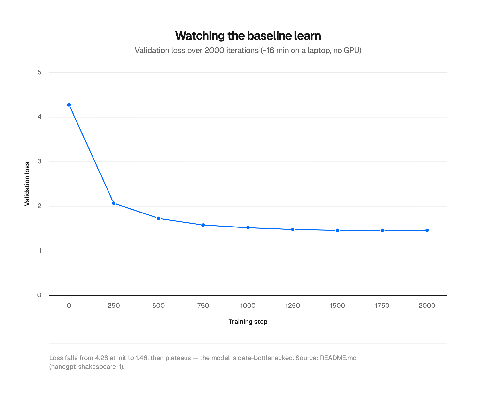
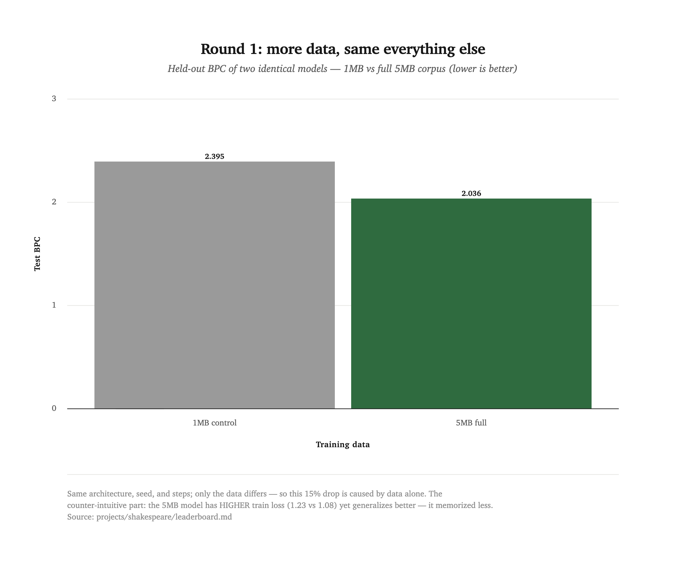
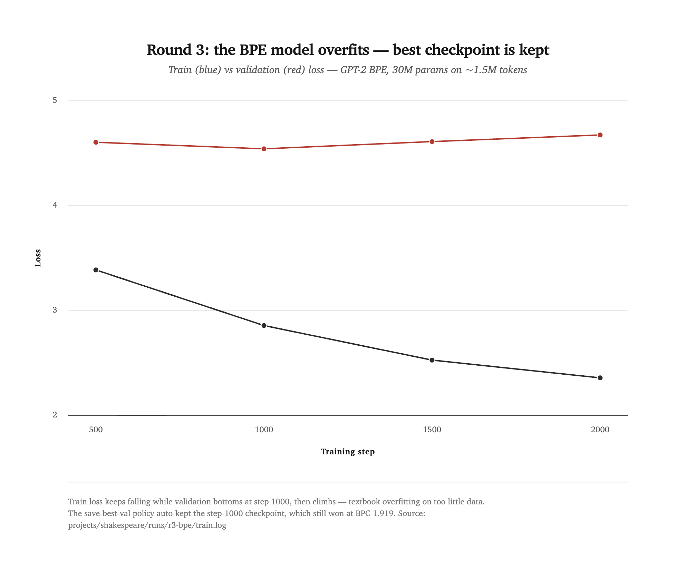
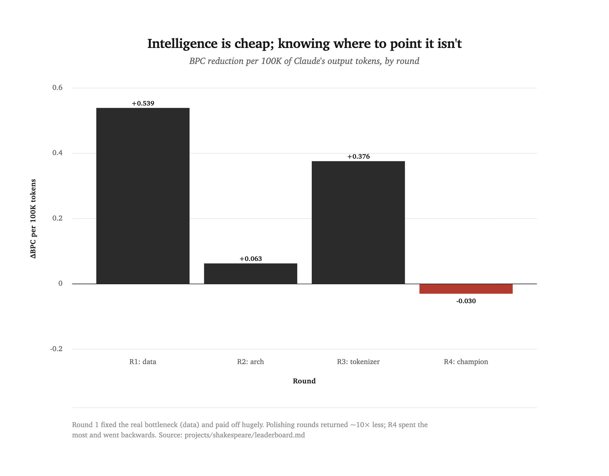
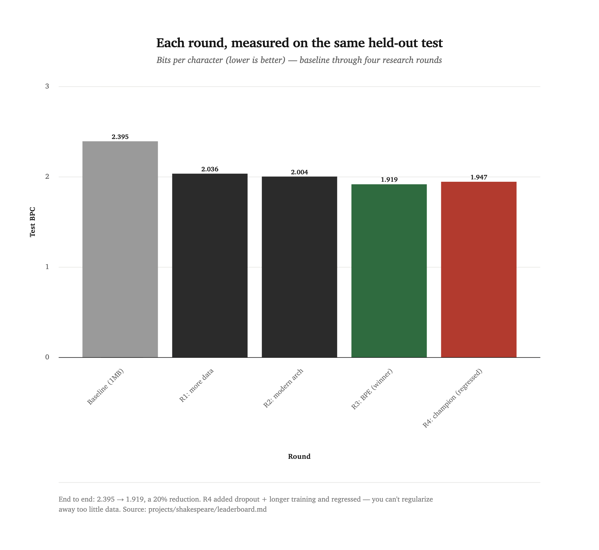

[← all experiments](README.md) · **Experiment 01** · Rounds 1–4 · `shakespeare-nanogpt-1 → -2` · June 2026

# Can a big model improve a small one?

An LLM-assisted research experiment, run end-to-end by Claude Opus 4.8 on a 10-million-parameter character-level GPT.
Companion piece to [How LLMs Actually Work](https://www.0xkato.xyz/how-llms-actually-work/) and to Anthropic's [When AI builds itself](https://www.anthropic.com/institute/recursive-self-improvement).

<div class="takeaways">
<p class="takeaways-label">Key takeaways</p>
<ul>
<li>Four rounds took held-out <code>BPC</code> from <strong>2.395 to 1.919</strong> (−20%) on a fixed, never-trained-on test slice.</li>
<li><strong>More data was the win</strong> (−15% alone). Modernizing the architecture was real but ~10× smaller per researcher-token; a better tokenizer rebounded by reusing prior work.</li>
<li>The Round 4 "champion" <strong>regressed</strong> — extra regularization can't substitute for too little data. <strong>Data is the ceiling.</strong></li>
<li>The real subject is <em>researcher cost</em>: leverage is large at a true bottleneck, small when polishing, and negative on a wrong guess — and measurement caught the step that went backwards.</li>
</ul>
</div>

## 0. Abstract

We trained a small language model — a "baby GPT" that writes fake Shakespeare one character at a time — and then asked a much larger model (Claude Opus 4.8) to act as the *researcher*: diagnose the small model's weaknesses, propose and implement changes, train new versions, and measure whether they got better. The big model picked *what* to try; the small model was the thing being improved.

This is **LLM-assisted research**, not recursive self-improvement. Claude acts as an automated researcher that implements, tests, and evaluates changes, while a human sets the direction and keeps oversight at every step. Per Anthropic's framing, recursive self-improvement (RSI) means ["an AI system capable of fully autonomously designing and developing its own successor"](https://www.anthropic.com/institute/recursive-self-improvement) — choosing its own goals — and "we are not there yet." This project sits at the article's current/precursor stage, where "humans have ideas, and the models are able to implement, test and evaluate them." The model never picks its own objective; it executes and measures under human direction.

Three of the four rounds worked — **more data**, a **modernized architecture**, and a **better tokenizer** — driving held-out bits-per-character from **2.395 down to 1.919** (a 20% reduction). The fourth round, a "champion" meant to push further, **regressed** — and taught the most by failing. Just as interesting as *whether* each change worked is *how much of the big model's effort it cost*, which lets us watch the researcher hit diminishing returns — and a dead end — in real time.

## 1. The small model

The starting point is Andrej Karpathy's `nanoGPT` trained on "Tiny Shakespeare" (~1 MB of the plays). It is **character-level**: its entire vocabulary is the 65 distinct characters in the text, and it predicts the next character over and over. No words, no meaning — just "given these characters, what character is likely next?" After ~16 minutes of training on a laptop GPU it produces things like:

```
ROMEO:
Thou hadst to do it.

CORIOLANUS:
That art sure to my husband, and I
Am come to this day.
```

Structurally Shakespeare; semantically nonsense. That is exactly what a model this small should do. The question of this experiment: **can the big model make it measurably better?**

<picture>
  <source media="(prefers-color-scheme: dark)" srcset="assets/exp01-training-loss.dark.png">
  
</picture>

## 2. How we measure "better" (this is the hard part)

You cannot improve what you cannot measure, and measuring is genuinely tricky. Two problems and how we solved them:

### Problem A: a fixed, fair test

Each change risks *contaminating* the test — if the model trained on the text we test it on, the score is a lie. So we carved one fixed **held-out slice** (250,000 characters) out of the corpus that *no* model ever trains on, and score every model on that same slice.

### Problem B: comparing apples to oranges

A character model's "loss" and a word-piece (BPE) model's "loss" are on totally different scales — you cannot compare them directly. The fix is **bits-per-character (BPC)**: total surprise of the test text divided by its number of characters. It is tokenizer-agnostic, so *every* model in this report — char or BPE, big or small — sits on one yardstick. Lower BPC = better prediction = better model.

### The two costs we track every round

- **Model training tokens** — how much compute the small model burned (tokens/iter × iterations). The *training* cost.
- **Claude tokens** — how many tokens the big model burned designing and implementing the round, read straight from the session transcript. The *researcher* cost.

Tracking both lets us ask the question Anthropic's essay cares about: *how much intelligence does each unit of improvement cost, and does that ratio get better or worse over time?*

The loop the big model runs each round: **diagnose** (read losses) → **propose** (pick a change) → **implement** (edit code) → **train** (~16 min/run) → **measure** (BPC) → repeat. The researcher does every step except TRAIN.

---

## 3. Round 1 — More data

**Diagnosis.** The baseline's training loss (1.08) was far below its validation loss (1.46), and the validation curve had gone flat. That is the fingerprint of **overfitting**: the model has memorization capacity to spare and is starved for data.

**The experiment.** A clean controlled test. Take the full Complete Works (~5 MB), and train two *identical* models — same architecture, same seed, same number of steps — differing in exactly one thing: one sees a 1 MB slice, the other sees all 5 MB. The difference in held-out score is then caused by data and nothing else.

<picture>
  <source media="(prefers-color-scheme: dark)" srcset="assets/exp01-data-win.dark.png">
  
</picture>

| Model | Train loss | Val loss | Test BPC |
|---|---|---|---|
| 1 MB control | 1.08 | 1.57 | 2.395 |
| **5 MB full** | 1.23 | 1.47 | **2.036** |

**Verdict: worked, big.** BPC 2.395 → 2.036, a 15% reduction — from data alone. Note the counter-intuitive part: the better model has the *higher* training loss. It memorized less and generalized more.

> Researcher cost: +66.6K Claude output tokens. Efficiency: 0.359 BPC per 66.6K tokens.

---

## 4. Round 2 — A modern architecture

**The change.** nanoGPT is deliberately simple. We rebuilt the transformer block with three upgrades from modern LLMs, holding the data fixed:

| Component | Original (2019-era GPT-2) | Modern |
|---|---|---|
| Normalization | LayerNorm (+ bias) | RMSNorm (simpler, bias-free) |
| Position info | Learned position table (wpe) | Rotary embeddings (RoPE) |
| Linear biases | Yes | None |

Same parameter count (~10.7M), same data, same steps — only the internals differ.

| Model (same 5MB data) | Test BPC |
|---|---|
| original architecture | 2.036 |
| **modern (RoPE + RMSNorm + bias-free)** | **2.004** |

**Verdict: worked, but small.** BPC 2.036 → 2.004, a 1.6% reduction. Here is the first real signal: this round cost about the same researcher effort as Round 1 (+50.8K tokens) but bought **~10× less improvement**. Once the data bottleneck is fixed, squeezing the architecture pays far less.

---

## 5. Round 3 — A better tokenizer

**The change.** Stop reading character-by-character. Use **GPT-2 byte-pair encoding (BPE)**, which represents text as subword chunks. Two consequences: each step covers ~3.2 characters instead of 1 (so a fixed window sees ~3× more context), but the vocabulary explodes from 100 to 50,257 — tripling the model to ~30M parameters.

**The twist.** On only ~1.5M tokens, the 30M-parameter BPE model *overfit*: validation loss bottomed at step ~1000 and then climbed. But our training always keeps the *best-validation* checkpoint, so it automatically "early-stopped." That early checkpoint still won:

<picture>
  <source media="(prefers-color-scheme: dark)" srcset="assets/exp01-bpe-overfit.dark.png">
  
</picture>

| Model (full data, modern arch) | Params | Test BPC |
|---|---|---|
| character-level | 10.7M | 2.004 |
| **GPT-2 BPE (early-stopped)** | 30M | **1.919** |

**Verdict: worked, with care.** BPC 2.004 → 1.919, a 4.3% reduction. And the efficiency *rebounded*: this round cost only +22.9K tokens because the entire modern-architecture toolkit from Round 2 was reused. **Reusing prior work makes the researcher cheap again** — another dynamic worth noting.

---

## 6. Round 4 — The champion

The finale stacks every winning move: full data + modern architecture + BPE, plus the fix for the one problem we found — more dropout (regularization) and a longer training budget to fight the overfitting from Round 3.

| Ingredient | From |
|---|---|
| Full 5MB corpus | Round 1 |
| RoPE + RMSNorm + bias-free | Round 2 |
| GPT-2 BPE tokenizer | Round 3 |
| Dropout 0.3 + 4000 iterations | new (fixes R3 overfit) |

| Model | Test BPC |
|---|---|
| **Round 3 (BPE, dropout 0.2, early-stopped)** | **1.919** |
| Round 4 champion (dropout 0.3, 4000 iters) | 1.947 ← worse |

**Verdict: it regressed.** The champion scored **worse** than the model it was built to beat. The extra dropout did not stop the overfit — validation loss rose the entire run (4.58 at its best, up to 5.06) — and the heavier regularization *slowed* learning, so the best checkpoint it could keep was worse than Round 3's. Training longer only made it worse. The sample collapsed into a degenerate loop:

```
ROMEO:
And Juliet's Cell.
FRIAR LAWRENCE.
O Romeo that I were? Romeo, Romeo,
That is the Romeo's son; Romeo, Romeo.
...
O Romeo, Romeo, Romeo, Romeo, Romeo and Romeo, Romeo, Romeo, Romeo, Romeo, Nurse.
```

**Why it failed — and why that is the point.** A 30M-parameter BPE model learning from only ~1.5M tokens is fundamentally data-starved. Dropout and longer training cannot manufacture data; they just slow the inevitable memorization. This reasserts the lesson of Round 1: **data is the bottleneck**. The true champion is simply Round 3 — which already combines all three productive levers. The researcher's intuition ("more regularization + more training will help") was plausible and wrong, and *measurement caught it*. That is the entire value of verification.

---

## 7. The real story: diminishing returns

Whether each change worked is only half the experiment. The other half is what it cost the *researcher*. Plotting improvement against the big model's token spend per round:

<picture>
  <source media="(prefers-color-scheme: dark)" srcset="assets/exp01-researcher-efficiency.dark.png">
  
</picture>

This is the experiment's tie to ["When AI builds itself."](https://www.anthropic.com/institute/recursive-self-improvement) The essay's core worry is that AI automating AI development could compound. Our toy shows the texture of that loop up close: the researcher's leverage is **not constant**. It is large when a true bottleneck is found (data), small when polishing a solved problem (architecture), large again when past work can be reused (tokenization), and **negative when the researcher guesses wrong** — Round 4 spent the most tokens of any round (+92.6K) and made the model *worse*. The interesting question is not "does it improve?" but "**does the cost of each improvement fall faster than the improvements shrink — and does verification reliably catch the steps that go backwards?**"

## 8. Summary: what worked and why

<picture>
  <source media="(prefers-color-scheme: dark)" srcset="assets/exp01-bpc-by-round.dark.png">
  
</picture>

| Round | Change | BPC | Worked? | Why |
|---|---|---|---|---|
| — | 1MB baseline (control) | 2.395 | — | data-starved, overfit |
| 1 | 5× more data | 2.036 | yes (−15%) | fixed the actual bottleneck |
| 2 | modern architecture | 2.004 | yes (−1.6%) | real but minor once data is fixed |
| 3 | BPE tokenizer | 1.919 | yes (−4.3%) | more context per step; needs early-stopping |
| 4 | champion (all + regularize) | 1.947 | no (regressed) | can't regularize away too little data |

## 9. This is round one of an ongoing practice

The experiment above produced `shakespeare-nanogpt-2` — but the point was never a single model. It was to set up a **repeatable loop** and a fixed yardstick (held-out bits-per-character) so the model can keep being refined, version after version, with every step measured against the same ruler. v1 → v2 is the first lap.

The results even point at the next one. Every productive round chipped at a different bottleneck, and Round 4 showed the current ceiling is **data** — regularization could not substitute for it. So a future `shakespeare-nanogpt-3` most likely starts with more or better training data, then runs the loop again from there. Each new version gets its own git tag, a leaderboard row, and an entry in `MODELS.md`. That is the small, honest shape of LLM-assisted research: not one leap, but a series of measured steps — some forward, some sideways, each one kept or discarded by verification.

## 10. Reproduce it

Everything is in the `shakespeare-nanogpt` repo.

```bash
# build the datasets (downloads the Complete Works)
uv run python projects/shakespeare/data/shakespeare_full/prepare.py
uv run python projects/shakespeare/data/shakespeare_full_bpe/prepare.py

# run a round (example: the modern architecture on full data)
uv run python core/nanogpt_core/train.py projects/shakespeare/config/train_shakespeare_mac.py \
    --dataset=shakespeare_full --out_dir=projects/shakespeare/runs/r2-arch-modern --bias=False

# score any checkpoint on the fixed held-out test (bits-per-character)
uv run python core/eval/eval.py projects/shakespeare/runs/r2-arch-modern \
    --test projects/shakespeare/test.txt --data-dir projects/shakespeare/data
```

The scoreboard lives in `projects/shakespeare/leaderboard.md`; every round's training log and result is committed under `projects/shakespeare/runs/`. Model weights are not committed (they regenerate from the scripts above).

The charts above are generated by the repo's [`dataviz`](../../tools/dataviz/) pipeline (`uv run python tools/dataviz/build.py`) and embedded here as light/dark PNGs.

---

The winning model (Round 3) is released as [`shakespeare-nanogpt-2`](../model-cards/shakespeare-nanogpt-2.md) (v2); the original baseline is [`shakespeare-nanogpt-1`](../model-cards/shakespeare-nanogpt-1.md) (v1). See [`MODELS.md`](../../projects/shakespeare/MODELS.md) in the repo for both specs and rebuild commands.

**Researcher:** Claude Opus 4.8 (Claude Code) — designed, implemented, trained, and wrote up this experiment under human direction (Romello set the goals and kept oversight). Built on nanoGPT by Andrej Karpathy (MIT). Corpus: the Complete Works of Shakespeare (public domain, Project Gutenberg).
