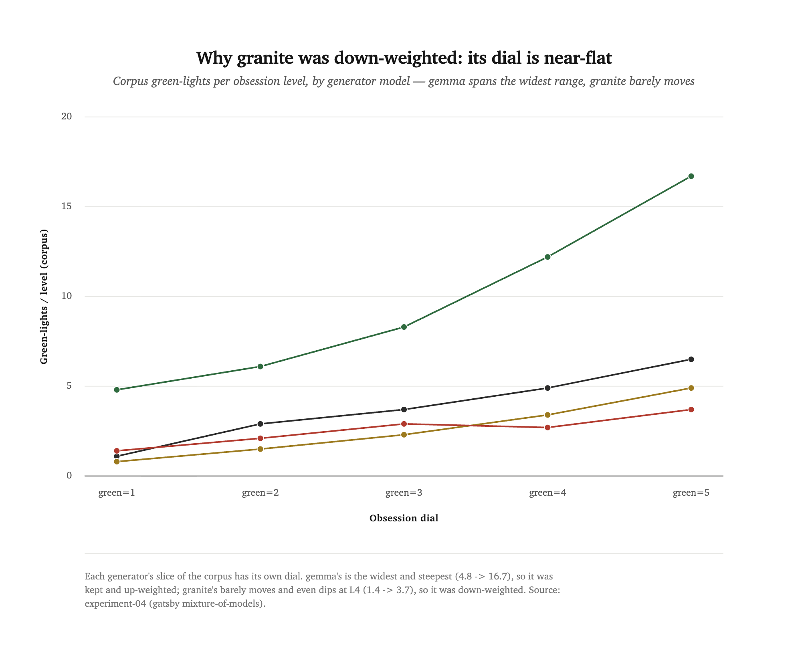
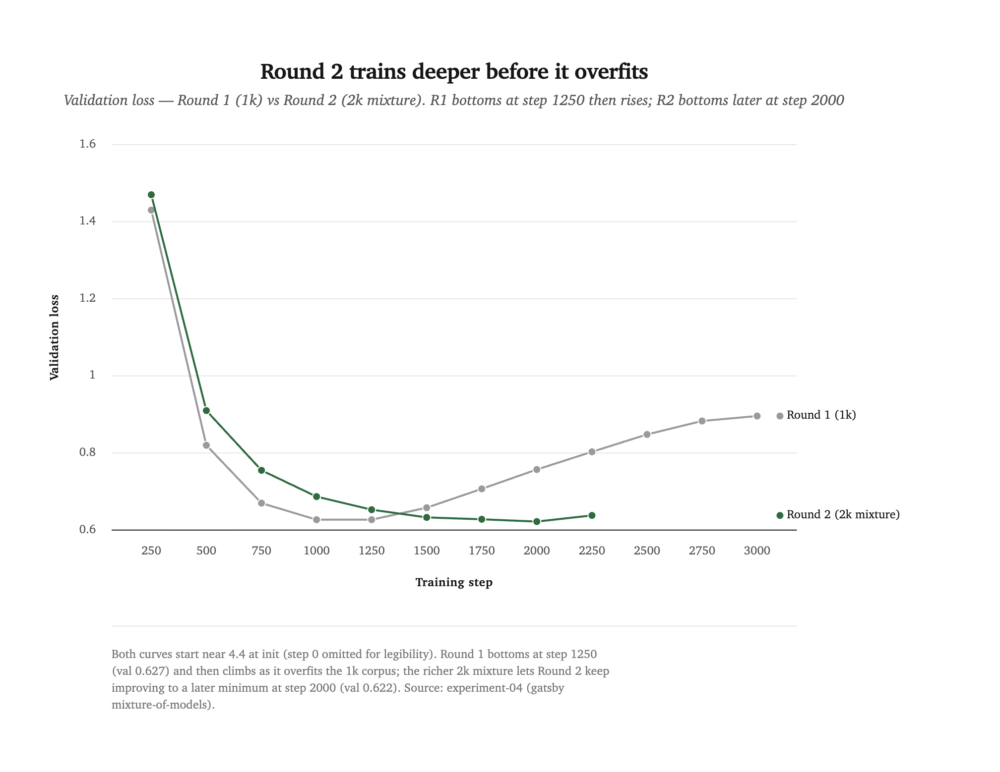
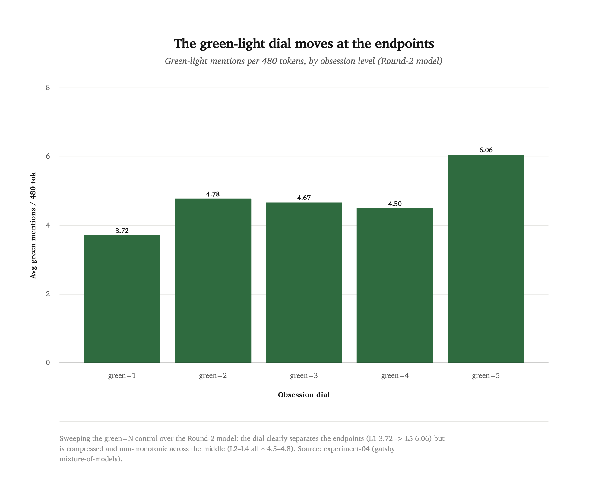

[← all experiments](README.md) · **Experiment 04** · Rounds r1–r2 · `→ gatsby-nanogpt-2` · June 2026

# Can four borrowed models write one obsession?

A fourth LLM-assisted research experiment, run end-to-end by Claude Opus 4.8. A sequel to [Experiment 02](obsession-on-a-dial.md), which built `gatsby-nanogpt-1`: a char-level model trained to be helplessly fixated on a green light, with the obsession's *intensity* baked into the training data as a `[green=N]` dial. That model's corpus was written, story by story, by the Claude API — about **$6** of `claude-sonnet-4-6`. This experiment asks whether we needed to pay for it at all.

Key takeaways

<ul>
<li>The corpus is now written by a <strong>mixture of four local open models</strong> running on a laptop — Olmo&nbsp;3, Ministral&nbsp;3, Gemma&nbsp;4, Granite&nbsp;4.1 — instead of the Claude API. Cost: <strong>$0</strong> (vs ~$6 for v1), and unbounded volume.</li>
<li>The resulting model, <code>gatsby-nanogpt-2</code>, <strong>matches the paid baseline's behaviour</strong>: the green light still barges into every story, and the intensity dial still works at its endpoints.</li>
<li>The headline finding is about <strong>the blend, not the pipeline</strong>. Generators are a disposable sampling device; <em>which</em> one you lean on is a design decision with teeth. A granite-heavy first round <strong>broke the dial flat</strong> — because Granite, measured per-model, barely modulates the green light across levels.</li>
<li>Rebalancing off Granite and <strong>doubling the corpus</strong> (1k→2k stories) fixed it: the model trained 60% deeper before overfitting (step 2000 vs 1250), which is the headroom it needed to learn the conditioning the corpus already contained.</li>
<li>New shared tooling: <a href="../../tools/synthgen/README.md"><code>tools/synthgen</code></a>, the generation analogue of <code>dataviz</code> — a provenance-first local-LLM corpus generator (<a href="../../docs/adr/0014-synthgen-local-llm-pipeline.md">ADR-0014</a>).</li>
</ul>

## 0. Abstract

`gatsby-nanogpt-1` proved you can put an obsession on a dial: a 10.7M-parameter char-level model with no un-obsessed mode, fixated on a green light whose intensity a `[green=N]` control line turns up and down. The mechanism is entirely in the data — the corpus is a thousand TinyStories-register stories, each written at a tagged obsession level, and the model learns to obey the tag. In v1 every one of those stories was written by Claude, billed per token.

This round replaces the writer. Instead of one paid model, **four free ones** — open-weight models from four different labs (AllenAI, Mistral, Google, IBM), run locally through LM Studio — each write a share of the corpus. The premise: a single generator is a *monoculture* (one model's idea of the task, filtered by one model's taste), and it costs money; a mixture is free, effectively unlimited, and carries four distinct voices. The generators become a sampling device, and the diversity is the point.

The result, [`gatsby-nanogpt-2`](../model-cards/gatsby-nanogpt-2.md), is **behaviourally peer to the paid baseline at zero marginal cost**. But getting there took two rounds, and the gap between them is the actual research content: **the blend is not a detail, it is the experiment.** The first attempt leaned 40% on Granite — chosen for being fast and clean — and the dial came out flat. Per-model measurement showed why: Granite barely turns the green light up across levels, so 40% of the corpus was teaching the model that the control line means nothing. Cutting Granite and doubling the data brought the dial back.

## 1. The bit: generators are disposable, the blend is not

The studio's premise is that the *data* is the model. For gatsby, the obsession isn't steered at inference — it's trained in, with no escape hatch. So everything rides on who writes the corpus and how.

v1's answer was "Claude, at intensity *N*." It worked, but it has two costs. The literal one: ~$6 to write a thousand stories, scaling linearly with every re-run and every ablation. And a subtler one: a corpus written by a single model is shaped end to end by that model's priors — its idea of a children's story, its idea of yearning, its idea of what "obsession level 5" reads like. There is exactly one voice in the room.

The alternative is to treat generation as **sampling from several distributions at once**. Run four different open models — different labs, different training data, different houses of style — and let each write a share. No single model's taste dominates; the corpus is a chorus. And because the models run locally, the marginal cost is electricity: you can write 2,000 stories, or 20,000, and thrash on the recipe without watching a meter.

But "mix four models" hides a decision that turns out to be load-bearing: **how much to lean on each.** The models are not interchangeable. They differ in speed (a 26B model is ~5× slower per story than a 7B one), in how clean their prose is, in how well they hold a topic — and, critically for this project, in **how hard they turn the dial.** Treating the blend as uniform, or picking weights by speed and cleanliness alone, is how the first round failed.

## 2. Method: a tool, a calibration, a blend

**The tool.** Generation now goes through [`tools/synthgen`](../../tools/synthgen/README.md), a small dependency-free module that is to corpus generation what `dataviz` is to charts: a single shared path that every synthetic corpus goes through. It talks to LM Studio's OpenAI-compatible endpoint, discovers whatever models are loaded, and — crucially for a research record — writes a **provenance manifest** alongside the corpus: every story stamped with the model that wrote it, the prompt, the sampling params, and a content hash. The data and *how it was made* are both committed. ([ADR-0014](../../docs/adr/0014-synthgen-local-llm-pipeline.md) records why it lives in `tools/`, is LLM-only, and is provenance-first.)

One backend wrinkle worth recording: the local models are *reasoning* models, and left alone they spend their entire token budget on a hidden chain of thought and return empty stories. The only switch that reliably suppressed it was `reasoning_effort: "none"` — now the engine default.

**The calibration.** Five candidate models were each asked to write the same grid — two topics × five obsession levels — and judged on register, coherence, obsession, dial response, and topic-honoring. The findings:

- **Qwen 3.6 (27B)** — fine quality, but **17–38 s/story**, 5–10× the others. Dropped: a corpus of it alone would take ~7 hours.
- **Gemma 4 (26B)** — the **best dial** by far and the most TinyStories-authentic register, but slow (~15 s/story).
- **Granite 4.1 (8B)** — fastest, cleanest output, best topic-honoring. Chosen as the v1 backbone.
- **Olmo 3 (7B)** and **Ministral 3 (8B)** — fast, with clean monotonic dials; AllenAI and Mistral voices for diversity.

Two practical findings shaped the pipeline. Throughput varies ~10× across models, so leaning on the fast ones is a feasibility constraint, not just a preference. And Olmo and Ministral inject markdown artifacts (`*emphasis*`, per-sentence line breaks) that would pollute a *character* vocabulary, so the driver cleans every story to gatsby's flowing-prose register and folds punctuation to ASCII — keeping the character vocabulary tight (73 in Round 1; 80 in Round 2, where a handful of stray numerals slipped through a few topics).

**The contract is unchanged.** The four models write into gatsby's existing, load-bearing format — the loud `[green=N] [green=N] [green=N] obsession=<word>` control line that [Experiment 02](obsession-on-a-dial.md) found was necessary for the char-model to condition on the tag at all. Each topic's five levels are written by a single model (so the within-topic dial stays a clean contrastive signal), with models rotating across topics.

## 3. Round 1: the dial breaks, and why

The first blend was picked for throughput and cleanliness: **Granite 40% · Gemma 30% · Olmo 15% · Ministral 15%**, 1,000 stories. It trained to a clean val-loss minimum (0.627 @ step 1250) — and the model was **worse than the paid baseline.** The green light still barged in, but the dial was flat and slightly inverted (green mentions per level `1.7 / 1.7 / 1.8 / 2.0 / 1.4` — level 5, the "swallowed" extreme, was the *lowest*), the prose was rough, and it ignored its topics.

The diagnosis is the experiment's core finding. The *corpus* dial was excellent — green-light mentions climbing monotonically `2.3 → 3.3 → 4.6 → 6.0 → 8.2` across levels — so the data modulated fine; the *model* simply failed to learn it. Measuring the dial **per generator** showed the culprit:

<picture>
  <source media="(prefers-color-scheme: dark)" srcset="assets/exp04-corpus-dial-by-model.dark.png">
  
</picture>

| generator | L1 | L2 | L3 | L4 | L5 | range |
|---|---|---|---|---|---|---|
| Gemma | 4.8 | 6.1 | 8.3 | 12.2 | 16.7 | **wide** |
| Olmo | 1.1 | 2.9 | 3.7 | 4.9 | 6.5 | clean |
| Ministral | 0.8 | 1.5 | 2.3 | 3.4 | 4.9 | clean |
| **Granite** | 1.4 | 2.1 | 2.9 | **2.7** | 3.7 | **flat** |

**Granite — the 40% backbone — barely turns the dial,** and even dips at level 4. So nearly half the corpus was teaching the model that the `[green=N]` tag is a weak predictor of intensity. Compounding it, the local models write tersely: 1,000 mixture stories came to **763K characters, a third smaller than the Claude 1k's 1.15M**. The model overfit by step 1250 — before it had learned to condition on the tag at all. Round 1 optimised the blend for the wrong virtues: Granite's speed and clean topic-honoring are real, but it is precisely the model that *kills the dial*.

## 4. Round 2: rebalance, scale, train deeper

Two changes, both pointed at the diagnosis. **Rebalance off Granite** toward the clean-dial models — **Olmo 30% · Ministral 30% · Gemma 20% · Granite 20%** — and **double the corpus** to 2,000 stories (1.53M characters, now *larger* than the Claude baseline) so the model has room to train past the overfitting cliff.

It worked, mechanically and visibly. Round 1 bottomed at step 1250 and turned up; **Round 2 kept descending to step 2000** (val 0.622) before overfitting — 60% deeper training, with a far healthier train/val gap (0.16 vs Round 1's 0.41 at the same step). The extra, more-diverse data is exactly what bought the depth.

<picture>
  <source media="(prefers-color-scheme: dark)" srcset="assets/exp04-loss-r1-vs-r2.dark.png">
  
</picture>

And the dial came back. Measured at 480 tokens (the length at which the "swallow" actually manifests — the obsession takes over *after* the topic intro, so a 240-token sample undercounts it), green-light mentions ramp **`3.7 → 4.8 → 4.7 → 4.5 → 6.1`** across levels:

<picture>
  <source media="(prefers-color-scheme: dark)" srcset="assets/exp04-dial.dark.png">
  
</picture>

The endpoints separate cleanly (L1 a brief end-note, L5 dominating the back half — *"he wants to see it more than anything … reaches for the green light"*), though the middle (L2–L4) is compressed rather than cleanly stepped. It is not as crisply monotonic as v1's hand-tuned `1.5 → 3.5`, but it is a working knob, recovered from a flat one by the blend change alone.

## 5. What it is

`gatsby-nanogpt-2` is a 10.7M-parameter char-level model, identical in architecture to v1, trained on a 2,000-story corpus written entirely by four local open models for $0. Behaviourally it is a **peer of the paid baseline**: the green light is inescapable, the dial works at its endpoints, and the prose sits in the same rough-but-recognisable TinyStories register. The difference is provenance — a chorus of four borrowed voices instead of one rented one — and cost: nothing.

The broader result is methodological. A mixture of small local models can stand in for a frontier API as a synthetic-data generator, at zero marginal cost and unbounded volume — *if* you treat the blend as a designed object and measure the dimension you care about per model, rather than picking generators by speed and surface polish. The generators are disposable; the weighting is the craft.

## 6. Limitations

- **The dial is compressed in the middle.** L1 and L5 separate, but L2–L4 bunch. Gemma carries the widest dial range and is only 20% of the blend (it is the slow model); a gemma-heavy round would likely sharpen the steps, at a throughput cost. Untested.
- **Coherence and topic-honoring are weak** — misspellings, collage openings, and topics that wander ("a robot" → dolphins, rocks). These are **not new to the mixture**: v1 had the same failures ("robot → rabbit"), and they are largely inherent to a 10.7M char-model on a few hundred topics. They were not the target of this round and remain unsolved.
- **The comparison is confounded.** Round 2 changed three things at once versus the Claude baseline — generator (paid→local mixture), blend, and corpus size — so "mixture matches Claude" is a claim about the *package*, not a clean single-variable ablation. The clean comparison this round does support is internal: Round 1 vs Round 2, where only the blend and size changed.
- **Val loss is not comparable across corpora.** v1, the Claude corpus, and the two mixture rounds have different vocabularies and validation splits; the loss numbers are convergence diagnostics within a run, not a cross-run yardstick. Quality here is behavioural, judged on the dial.
