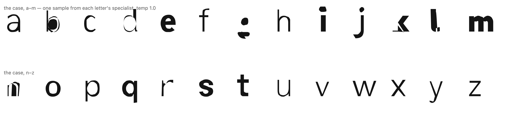
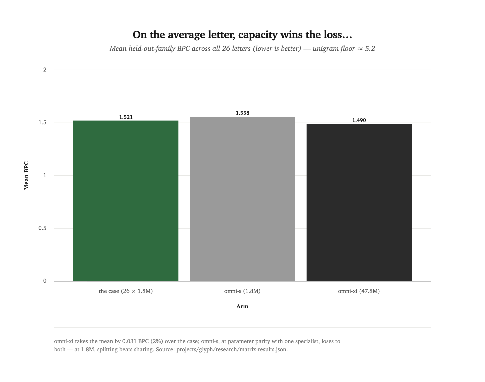
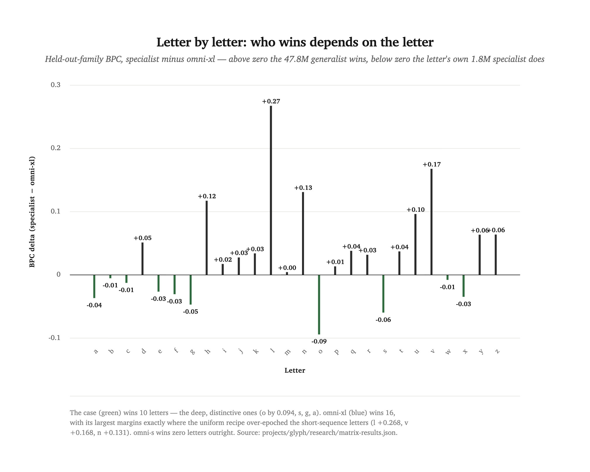
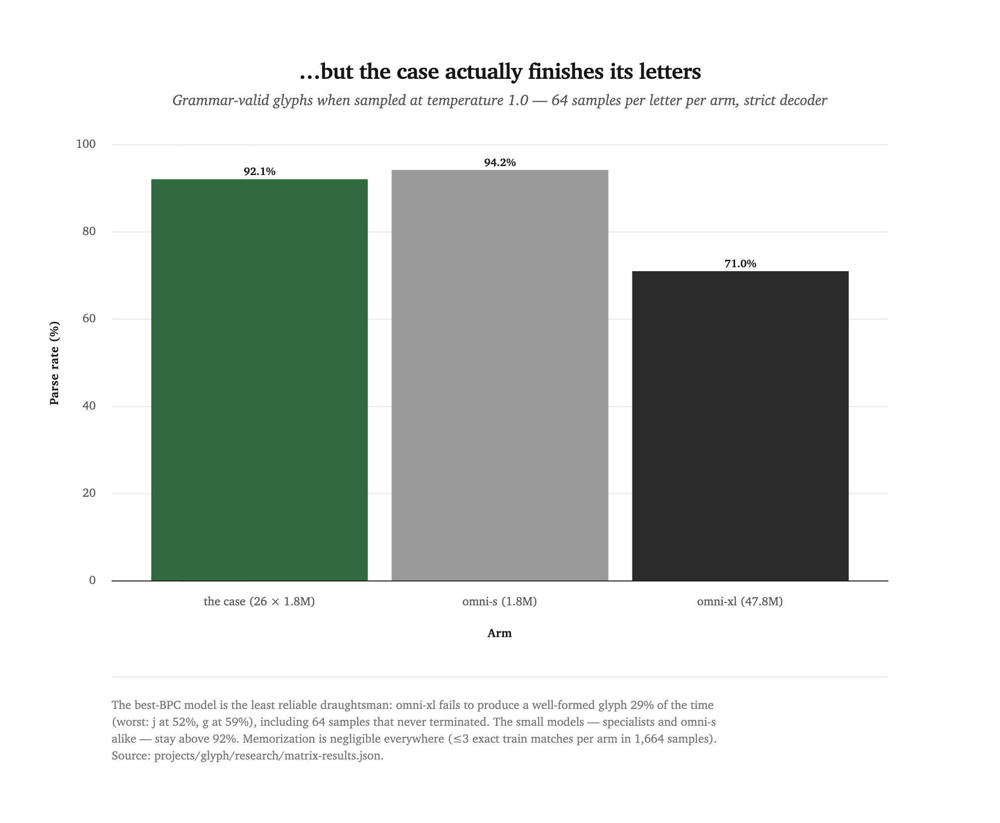
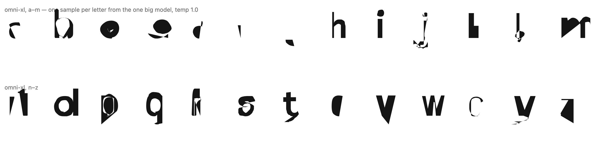
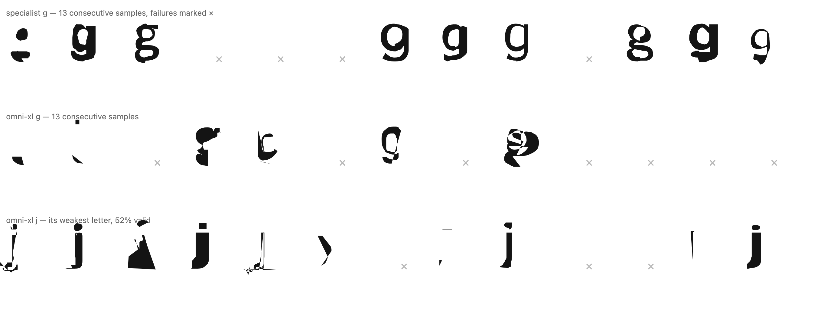

[← all experiments](README.md) · **Experiment 09** · Runs a-r1 … z-r1, omni-s-r1, omni-xl-r1 · `→ glyph-nanogpt-a-1 … -z-1` · July 2026

# One model or twenty-six?

Give a fixed parameter budget two shapes: one 47.8M-parameter model that
draws every lowercase letter, or twenty-six 1.8M specialists that each draw
exactly one. The big model wins the loss table by 2% — and fails to finish
a letter 29% of the time, against 8% for the specialists.

<div class="takeaways">
<p class="takeaways-label">Key takeaways</p>
<ul>
<li>At <strong>parameter parity</strong> the question isn't close: a 1.8M generalist conditioned on letter identity loses to the letter's own 1.8M specialist on every one of 26 letters (mean BPC 1.558 vs 1.521).</li>
<li>Give the generalist the <strong>sum of the case's budget</strong> (47.8M ≈ 26 × 1.8M) and the loss flips: omni-xl takes 16 of 26 letters and the mean (1.490) — but its biggest wins sit exactly where the case's uniform training recipe over-trained the short, simple letters.</li>
<li>The loss and the drawing <strong>disagree</strong>: sampled at temperature 1.0, the case produces a grammar-valid glyph 92.1% of the time, omni-xl 71.0% — and its survivors look worse than the gap sounds. Best model by loss, least reliable draughtsman.</li>
<li>The 47.8M model also <strong>couldn't train on the shared recipe</strong> — three runs diverged at lr 3e-4 / beta2 0.99 before the standard big-model adjustment (1e-4 / 0.95) held. The one-big-model shape carried its own operational tax.</li>
<li>Memorization, the failure mode this corpus size invites, <strong>didn't happen</strong>: ≤3 exact train-set matches per arm across 1,664 samples each, after variable-font weight instancing lifted every letter to 1,466–1,991 training glyphs.</li>
</ul>
</div>

The corpus is type history flattened to text: 759 OFL-licensed sans-serif
families from Google Fonts, every upright weight, each glyph outline
serialized as one line where one printable character is one token — drawing
verbs `M L Q Z`, coordinates from a 96-character alphabet on a 16-unit grid,
the em normalized to 1024 ([ADR-0027](../../docs/adr/0027-glyph-one-char-per-token-outline-codec.md)).
81,934 glyphs, deduped to a fixed family split so every model — specialist or
generalist — is scored on font families none of them ever saw. A specialist
compresses the distribution of one letter across hundreds of disagreeing
hands. Sampling it pulls out a new individual every time.

This is what the case draws. One sample per letter, its own specialist each,
no cherry-picking — the near-misses (that `g`, that `k`) ride along:

<picture>
  <source media="(prefers-color-scheme: dark)" srcset="assets/exp11-specimen-case.dark.png">
  
</picture>

## At parameter parity, splitting wins everywhere

The first arm answers the cleanest version of the question: same 1.8M
parameters, same recipe, same tokens — split into 26 instruments or shared
by one conditioned model? The specialists win the mean, and omni-s does not
take a single letter outright. Twenty-six times more data through the same
capacity bought nothing; the pilot's 3-letter generalist (val loss 1.014)
and the full 26-letter one (1.012) landed within noise of each other, so
capacity, not transfer, was the binding constraint all along.

The chart puts the three arms side by side. Look at the middle bar: omni-s
loses to the case it was supposed to consolidate.

<picture>
  <source media="(prefers-color-scheme: dark)" srcset="assets/exp11-mean-bpc-by-arm.dark.png">
  
</picture>

## Give the generalist the whole budget and the loss flips

omni-xl — 12 layers, 576 embed, 47.8M parameters, the case's budget in one
body — takes the mean by 0.031 BPC and 16 of 26 letters. That is the honest
headline for the one-big-model position, and it deserves its chart.

But read where its wins live. Above the zero line, omni-xl's four biggest
margins are `l` (+0.268), `v` (+0.168), `n` (+0.131), and `h` (+0.117) —
short-sequence letters whose specialists overfit under the case's uniform
recipe (3,000 identical steps means a simple letter's tiny token corpus gets
epoched several times harder; `l`'s specialist hit train loss 0.14 against
val 1.82 before best-val checkpointing rescued its weights). Below the line,
the case's wins are the deep, distinctive letters: `o` by 0.094, `s`, `g`,
`a`, `e`. The generalist wins where the case hurt itself. The case wins
where the letters have the most to say.

<picture>
  <source media="(prefers-color-scheme: dark)" srcset="assets/exp11-bpc-delta-by-letter.dark.png">
  
</picture>

## The best loss can't finish its letters

Loss is a promise; sampling is the product. Sixty-four samples per letter
per arm at temperature 1.0, run through the codec's strict decoder: the case
parses 92.1%, omni-s 94.2%, omni-xl 71.0%. The gap is not close, and it is
not bleed — the letter token leads every sequence, so every failure is pure
grammar and termination: contours that never close, coordinate pairs cut
short, 64 omni-xl samples that ran past the length budget without ever
emitting a glyph boundary. Its worst letters are `j` (51.6% valid) and `g`
(59.4%).

<picture>
  <source media="(prefers-color-scheme: dark)" srcset="assets/exp11-parse-rate-by-arm.dark.png">
  
</picture>

And the parse rate flatters it. Here is the same alphabet drawn by omni-xl —
its survivors are wilder, blobbier, further from letterform than the case's:

<picture>
  <source media="(prefers-color-scheme: dark)" srcset="assets/exp11-specimen-omni-xl.dark.png">
  
</picture>

Thirteen consecutive `g` attempts from each arm make the texture difference
plain — the specialist's failures are degraded g's; the generalist's are
often not letters at all:

<picture>
  <source media="(prefers-color-scheme: dark)" srcset="assets/exp11-failure-gallery.dark.png">
  
</picture>

One reading: at this corpus size the big model has capacity to spare for
distributional detail, which buys likelihood, while the small models are
forced into grammatical discipline, which buys legibility. Another: the
temperature was simply kind to sharp small models — a sweep below 1.0 might
close some of the gap. This round only measured 1.0. Worth knowing before
anyone treats 71% as omni-xl's ceiling.

## Be honest: what still doesn't work

- **The case over-trained its simplest letters, and that is the case's own
  flaw.** Per-letter token corpora vary several-fold with glyph complexity;
  a uniform 3,000 steps over-epoched the short letters into overfit (`l`:
  train 0.14, val 1.82). Best-val checkpointing contained the damage but
  didn't erase it — omni-xl's 16 BPC wins are concentrated exactly there.
  Twenty-six instruments need twenty-six tuning decisions; pretending
  otherwise cost the case the loss table.
- **The capacity comparison bent one control.** The shared optimizer recipe
  (lr 3e-4, beta2 0.99) diverged three times at 47.8M — healthy to ~step
  600, then the loss exploded, grad-clip active throughout — before the
  standard adjustment (1e-4, 0.95, longer warmup) held. So the arms did not
  train identically. One reading: an even better-tuned xl leaves more BPC on
  the table. Another: needing a bespoke recipe at all is a real cost of the
  one-big-model shape, and it nearly cost the run.
- **One seed per model.** The coin-flip letters — `m` (+0.004), `b`
  (−0.005), `w` (−0.008) — are within plausible seed noise, and no variance
  estimate exists this round. The 10-vs-16 letter split should be read as
  roughly-even, not exact.
- **Valid ≠ legible.** The parse rate is a grammar check, not a shape
  metric; omni-xl's grammar-valid `g`s are visibly less g-like than the
  specialist's, and nothing in this round quantifies that visual gap beyond
  the specimens above.
- **The grid is lossy at the extremes.** Thin weights (~20-unit stems on a
  16-unit grid) survive with visible stem wobble — an accepted cost of
  keeping the ensemble rather than any single designer's optical
  corrections, documented in the codec ADR.

## The release: the case

The studio ships one glyph-nanogpt, not a menu — and it's the twenty-six.
The deciding facts, in order of weight: the case draws reliably (92% vs
71%, with the visual gap wider than the numbers); its losses to omni-xl
trace mostly to a fixable recipe flaw rather than anything structural; it
runs in a browser as 26 lazy 7MB instruments instead of one ~190MB
download; and it trained without incident on the recipe the big model
diverged on three times. omni-xl's 2% mean-BPC edge is real and this report
keeps saying so — it is a number, and the released thing is a drawing
instrument.

What the finding means: parameter count consolidates likelihood, not
craft. Sliced against data this small, one big model learns the
distribution's texture and loses the discipline of the line; twenty-six
small hands each learn one letter well enough to finish it. If the next
round gives the case per-letter tuning and omni-xl a temperature sweep and
both arms three seeds, the gap that matters — finished letters — has room
to move in either direction. Worth the round.

## Reproduce it

```bash
uv run python projects/glyph/data/fetch_fonts.py      # freeze the pool (manifest pins the commit)
uv run python projects/glyph/data/encode_corpus.py    # 82k glyphs -> one-char-per-token lines
uv run python projects/glyph/data/roundtrip_sheet.py  # the legibility gate — look at it
uv run python projects/glyph/data/prepare.py          # per-letter + omni datasets, splits, baselines

for ds in a b c d e f g h i j k l m n o p q r s t u v w x y z; do
  uv run python core/nanogpt_core/train.py projects/glyph/config/specialist.py \
    --dataset=$ds --out_dir=projects/glyph/runs/$ds-r1
done
uv run python core/nanogpt_core/train.py projects/glyph/config/omni_s.py
uv run python core/nanogpt_core/train.py projects/glyph/config/omni_xl.py

uv run python projects/glyph/matrix_eval.py           # 78 BPC evals + harness -> matrix-results.json
```

## Credits

Corpus design, codec, training, evaluation, and this write-up: Claude Fable 5
(Claude Code). Direction, scope calls, and the singular-release policy:
Romello Goodman. Fonts: 759 OFL families via
[google/fonts](https://github.com/google/fonts), credited individually in
`projects/glyph/data/manifest.json`. Prior art conversation: Eli Heuer's
[Virtua Grotesk](https://elih.net/blog/virtua-grotesk/), which trains one
model on one perfectly disciplined hand — this experiment inverts it.
