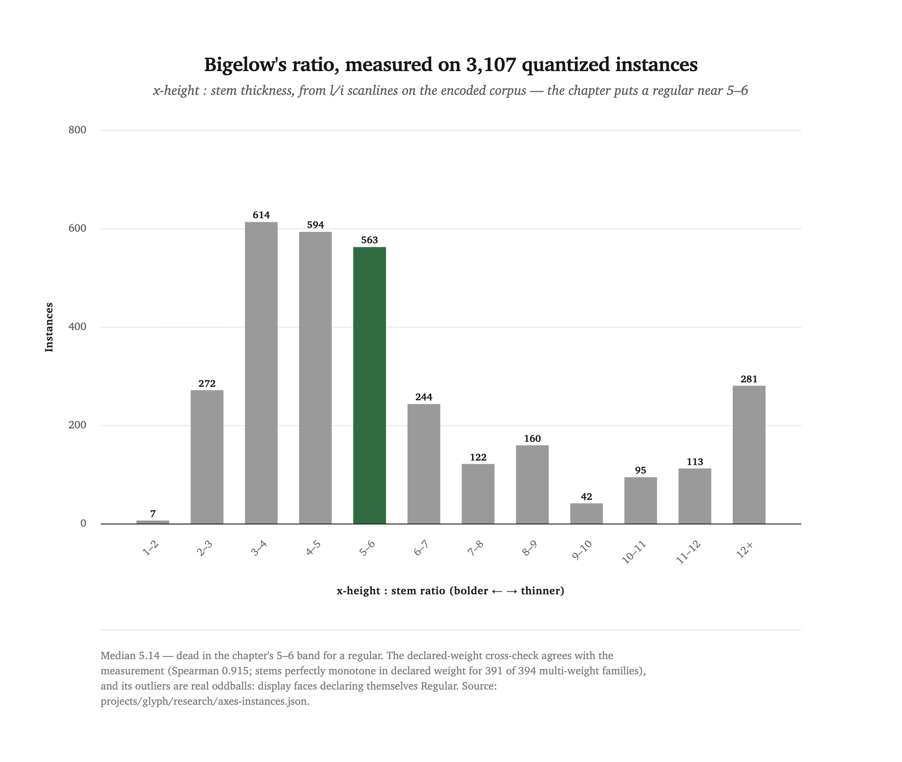
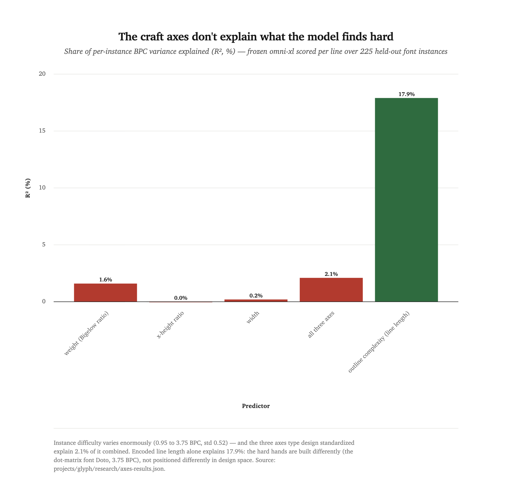
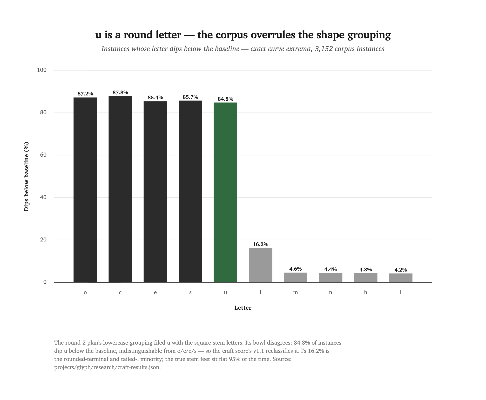
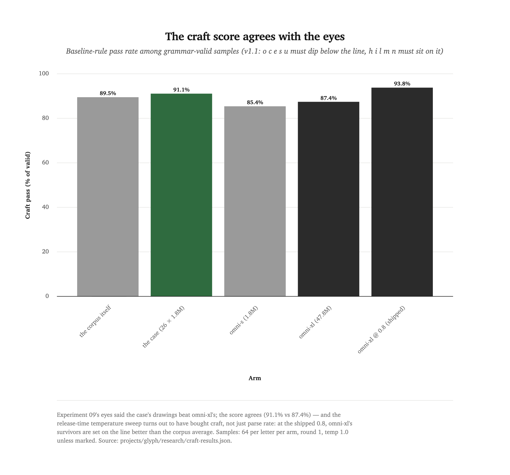

[← all experiments](README.md) · **Experiment 10** · No training runs — measurements over the round-1 corpus, checkpoints, and samples · July 2026

# Three predictions from a font chapter

A training plan is a stack of bets, and most of them can't be checked until
the compute is spent. This one had three that could: measured against the
frozen round-1 artifacts, the domain knowledge behind glyph's round-2 plan
went one-for-three — one bet dead, one confirmed, one right only after the
corpus corrected it.

<div class="takeaways">
<p class="takeaways-label">Key takeaways</p>
<ul>
<li>glyph's draft round-2 plan operationalizes a type-design chapter — Dan Hollick's <a href="https://www.makingsoftware.com/chapters/how-to-make-a-font">"How to make a font"</a> — into conditioning axes, training curricula, and a craft-rule checkpoint score. Its three <strong>testable-without-training</strong> predictions were run first, for the cost of an afternoon of eval compute.</li>
<li>The axes are real but the premise died: weight, x-height, and width are cleanly measurable from the encoded corpus (median Bigelow ratio 5.14, dead in the chapter's 5–6 band; declared-weight cross-check Spearman 0.915) yet explain <strong>2.1%</strong> of the variance in which hands the frozen generalist finds hard. Outline complexity alone explains 17.9%.</li>
<li>Gate 0 passed: the 16-unit grid <strong>binarized overshoot instead of erasing it</strong> — 85–88% of round-letter instances keep a full grid-step dip below the baseline, so the craft signal survives in the corpus and a model can be scored on it.</li>
<li>The corpus overruled the plan's own shape grouping: <strong>u is a round letter</strong> — 84.8% of instances dip its bowl below the baseline, indistinguishable from o/c/e/s, against 4–16% for the true stem-footed letters.</li>
<li>The corrected craft score agrees with experiment 09's eyes — the case out-crafts omni-xl 91.1% to 87.4% among valid samples — and retroactively shows the release-time temperature sweep <strong>bought craft, not just parse rate</strong> (93.8% at the shipped 0.8, above the corpus's own 89.5%).</li>
</ul>
</div>

## A plan is a stack of bets

Round 1 ([experiment 09](one-model-or-twenty-six.md)) was domain-blind on
purpose: serialize outlines to text, train, measure compression and parse
rate. Its failures came back in ML vocabulary — unexplained variance, overfit
gaps, termination failures, a loss metric that disagreed with the product.
True, and inert.

Then a craft chapter entered the context window. Dan Hollick's
["How to make a font"](https://www.makingsoftware.com/chapters/how-to-make-a-font)
names the axes hands differ along (weight as Bigelow's ratio of x-height to
stem thickness, x-height, width), the order designers derive letters in, and
the optical corrections a drawn letter must carry — round bottoms overshoot
the baseline, stem feet sit exactly on it. The draft round-2 training plan is
that chapter operationalized: condition on measured axes, warm-start along
derivation lineage, checkpoint on craft rules instead of loss alone. Roughly
fifty training runs, if taken at face value.

But three of the plan's load-bearing claims are predictions about *the corpus
and the instruments*, not about a trained model — which means they are also
the plan's own pre-training gates, checkable now against round 1's frozen
artifacts: the encoded corpus, the omni-xl checkpoint, and 1,664 samples per
arm. So this round trains nothing and measures everything the plan lets it.
Two new living instruments do the work:
[`measure_axes.py`](../../projects/glyph/measure_axes.py) and
[`craft_score.py`](../../projects/glyph/craft_score.py).

## Prediction one: the axes explain the variance. Dead.

The plan's biggest arm — a conditioned 47.8M generalist — rides on the claim
that the 759 hands the model carries as unexplained variance differ along the
chapter's three standardized axes. Half of that claim measures beautifully.
Per instance, from the quantized corpus itself: stem thickness from scanlines
through `l` and `i` at half x-height, x-height and ascender from exact curve
extrema, width from mean advance. The instrument checks out against the
chapter and against the fonts' own declarations.

The distribution lands where the chapter said it would. The green band is
Bigelow's regular:

<picture>
  <source media="(prefers-color-scheme: dark)" srcset="assets/exp12-bigelow-histogram.dark.png">
  
</picture>

Median 5.14, in a corpus the chapter never saw, measured through a 16-unit
grid. The declared-weight cross-check agrees: Spearman 0.915 between declared
weight and measured stem, and within the 394 families carrying three or more
weights, stems are perfectly monotone in declared weight for 391. The three
outlier families are real oddballs — display faces like Bytesized declaring
themselves Regular while drawing a stem three-quarters of an x-height wide.
The measurement is fine. The premise is not.

Scoring the frozen omni-xl per line over 225 held-out instances (6,142
lines; 1,484 dropped as duplicates of training families) gives each hand a
difficulty number, and the hands differ enormously: 0.95 to 3.75 BPC,
standard deviation 0.52. The variance the plan wants to explain is real.
Look at what fails to explain it — the red bars:

<picture>
  <source media="(prefers-color-scheme: dark)" srcset="assets/exp12-axes-variance.dark.png">
  
</picture>

All three axes together: R² = 0.021. Encoded line length alone: 0.179. The
easiest hands are conventional grotesques (Golos Text at 0.95 BPC); the
hardest is Doto at 3.75 — a dot-matrix face whose every glyph is dozens of
tiny squares. The hard hands are not heavy or narrow or small-eyed. They are
**built differently** — and no three-number summary of design-space position
sees that.

Two honesty notes on the number. The corpus compresses two of the three axes
into almost nothing — the x-height ratio's middle quartiles span 0.694 to
0.714 in an upright sans pool — so their zero is partly restriction of
range. But weight spans 1.33 to 38 and still explains 1.6%. And the
regression only kills the premise as stated: conditioning-as-difficulty-
explanation. Conditioning as a *steering knob* — draw me a bold, wide `g` —
is untouched by this measurement, because a signal can pick which glyph gets
drawn without making any glyph easier to predict. What died is the plan's
prediction that conditioning makes training easier and buys BPC.

## Prediction two: quantization erased overshoot. Wrong — it binarized it.

Gate 0 was the plan's own suspicion about its instrument: typical overshoot
is 1–1.5% of the em, the codec's grid step is 16/1024 ≈ 1.6%, and the
chapter never quantifies "slightly" — so the round-2 craft score might be
built on a signal the corpus no longer carries. The plan's rule: if fewer
than ~60% of round-letter instances keep a full-step dip, drop overshoot
from the composite.

Measured with exact curve extrema over 3,152 instances: `o` dips below the
baseline in 87.2% and dips a *full grid step* in 87.1%. The gap between
"any dip" and "full-step dip" is a rounding error on every round letter —
quantization didn't attenuate overshoot, it snapped each instance's dip to 0
or 16 units, and for six hands in seven it snapped down, to the full step.
The median surviving dip is exactly one grid step. The signal is present,
learnable, and scoreable; the gate passes at 85–88% against its 60% bar. The
x-height side is fainter (64–65% rise above the flat-letter median) but
present.

## Prediction three: the shape grouping. Right after the corpus fixed it.

The craft score's v1 rules were pre-registered before any number was looked
at: round letters (`o c e s`) must dip below the baseline; flat letters
(`h i l m n u`) must sit on it within 2 em-units. The flat set came from the
round-2 plan's lowercase adaptation of the chapter's uppercase-only shape
groups. The corpus vetoed one placement immediately:

<picture>
  <source media="(prefers-color-scheme: dark)" srcset="assets/exp12-u-dips-below-baseline.dark.png">
  
</picture>

Type designers treat `u`'s bowl bottom as a round bottom: 84.8% of instances
dip it below the baseline, statistically at home with `o c e s` and nowhere
near the true stem feet at 4–5%. Its top never crosses the x-height (1.4%) —
flat stem tops, round bowl bottom, a letter the uppercase grouping has no
slot for. The score's v1.1 reclassifies it, exactly the correction mechanism
the plan specified for a score that disagrees with reality. (`l`'s 16.2% is
a genuine minority of rounded-terminal and tailed designs, not a
misclassification — the other stem letters sit flat 95% of the time.)

With the corrected instrument, the eyes-test. Experiment 09's on-record
visual ranking said the case's drawings beat omni-xl's, with a gap wider than
the parse rates suggested. The score agrees, in both the pre-registered and
corrected versions — and the corpus itself, scored as an arm, becomes the
reference bar:

<picture>
  <source media="(prefers-color-scheme: dark)" srcset="assets/exp12-craft-by-arm.dark.png">
  
</picture>

Three things fall out. The case out-crafts omni-xl among valid samples,
91.1% to 87.4% (80.8% to 79.0% under v1) — the score ranks the arms the way
the specimen sheets did. omni-s, whose 94.2% parse rate led round 1's
grammar table, lands last on craft (85.4%): finishing letters and setting
them on the line are different skills, and the little generalist only has
the first. And the release-time temperature sweep, run in round 1 purely to
lift omni-xl's parse rate, turns out to have bought craft too: at the
shipped 0.8, survivors pass 93.8% — above the corpus's own 89.5%.

The split under the composite is sharper than the headline. Every arm
*over*-overshoots: round-letter pass rates run 94–99% against the corpus's
86% — the models learned the majority behavior and regularized the
exceptions away. Every arm at temperature 1.0 *under*-sits: flat-letter pass
runs 77–86% against the corpus's 93%. Overshoot is a majority habit, and
majority habits are what small models amplify; sitting flat is a precision
behavior with no tolerance, and sampling noise eats it.

## Be honest: what a training-free round can't say

- **No model trained means no model improved.** The 92.1%-valid debt from
  round 1 stands untouched. This round repriced the plan that would pay it;
  it paid nothing itself.
- **The regression kills a premise, not the lever.** Conditioning's
  steerability value is untestable without a conditioned model — R² = 0.021
  rules out "the axes explain difficulty," not "the axes steer sampling."
  A future conditioned arm should be justified as a knob, and expected to
  buy no BPC.
- **The craft score is necessary, not sufficient.** It checks whether a
  glyph is set on the line, not whether it is a good letter — the case's
  3.7-point craft margin over omni-xl is far narrower than the visual gap in
  the specimen sheets. A score for letterform quality still doesn't exist.
- **The samples-side score is baseline-only.** A sampled glyph carries no
  hand context, so the x-height overshoot rule can't be checked on model
  output — corpus mode checks both sides, sample mode one.
- **225 instances, one model, one ranking.** The regression's n is the
  held-out split of one corpus; the difficulty scores come from one frozen
  checkpoint; the eyes-test compares against a single on-record ranking
  (case over omni-xl). Complexity's 17.9% is correlation, not mechanism —
  line length and construction style arrive together.

## What this does to the round-2 plan

The expensive half of the plan is now differently priced. Its conditioning
arm — the biggest single cost — lost its headline justification and keeps
only the steerability one. Its checkpoint-selection score is validated,
corrected (v1.1), and already ranks arms the way eyes do. Its Gate 0 and
Gate 1 are run and passed: overshoot survives at 85–88%, and the
corpus-quantile bin edges the conditioning spec asked for are computed and
committed (weight bins at ratio 3.50/4.43/5.67/8.25; the x-height and width
axes barely vary in-corpus, which is its own argument against conditioning
on them). Per-letter budgets and the relative-codec pilot are untouched by
any of this. A cheaper, better-aimed round 2 is available whenever the
studio wants it — and it inherits both instruments unchanged.

What the finding means: domain knowledge in the context window named round
1's failure modes, built its measuring sticks, and made its predictions —
and the predictions went one-for-three. The chapter was never wrong about
type; it was wrong about what a language model finds hard, which is not a
question the chapter ever claimed to answer. Craft knowledge writes the
instruments. The corpus decides the bets.

## Reproduce it

```bash
uv run python projects/glyph/craft_score.py            # Gate 0 + the craft composite
uv run python projects/glyph/measure_axes.py           # axes, bins, cross-check, regression
uv run python projects/glyph/measure_axes.py --no-bpc  # skip the checkpoint scoring
```

Results land in `projects/glyph/research/{craft-results,axes-results,axes-instances}.json`;
the round-1 inputs (checkpoints, samples) are the frozen `runs/*-r1` evidence.

## Credits

Measurements, instruments, and this write-up: Claude Fable 5 (Claude Code).
Direction and the train-nothing-first call: Romello Goodman. Craft grounding:
Dan Hollick's ["How to make a font"](https://www.makingsoftware.com/chapters/how-to-make-a-font)
(Making Software) — Bigelow's weight ratio, the optical-correction rules, and
the shape-group idea this experiment's corpus talked back to. Round-1
evidence: [experiment 09](one-model-or-twenty-six.md) and the
[glyph leaderboard](../../projects/glyph/README.md#leaderboard).
